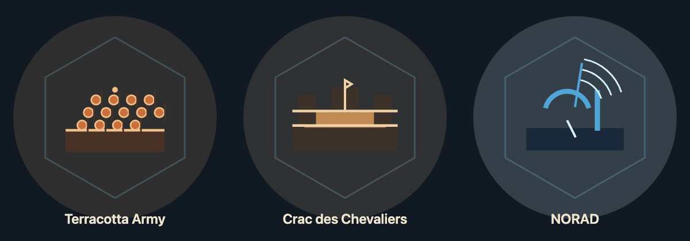

# Issue #725 — rendered landmark and animation preview

This is the exact completed-landmark Canvas output from this PR, captured from the worktree renderer at eight fixed timestamps and encoded as a looping animation. It is not concept art or a replacement asset.

From left to right:

- **Terracotta Army**: the army ranks and wall remain fixed; the small top glint travels horizontally.
- **Crac des Chevaliers**: fortress walls, towers, and keep remain fixed; only the pennant tip has a restrained flutter.
- **NORAD**: bunker, dish, mast, and signal arcs remain fixed; the thin blue sweep advances across the dish.

The loop samples the renderer at `nowMs` 0 through 2100 in 300 ms intervals. The normal game renderer evaluates these same functions each frame. With reduced motion enabled, each asset retains the shown static geometry and uses a fixed glint, pennant, or sweep position instead of time-based motion.
