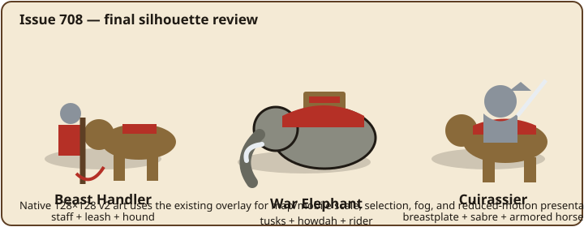

# Issue 708 visual review — mounted and beast formations

This draft-PR review covers the final distinction contract. The committed native SVG modules are the source of truth; this guide highlights the map-scale cues reviewers should verify.

| Unit | Player-readable identity | Replaces | Animation/accessibility contract |
| --- | --- | --- | --- |
| Beast Handler | Handler, staff, leash, and trained hound | War Hound | Quadruped gait hooks; static art and selection/health layers remain visible with reduced motion. |
| War Elephant | Tusked heavy animal, howdah, rider | War Hound | Quadruped gait hooks; broad silhouette remains distinguishable without relying on color. |
| Cuirassier | Breastplate, sabre, armored horse | Knight | Melee weapon and impact hooks; sabre separates it from the Knight's lance. |

## Implementation and safety review

- Gameplay balance, mechanics, production, AI, difficulty, data, saves, SFX, and solo/hot-seat rules are unchanged. This PR changes only the existing rendering paths.
- The existing viewer-scoped fog filter remains upstream of sprite resolution. The new art cannot reveal an unseen unit or leak a previous hot-seat player's information.
- The existing overlay preserves selected and health decorations, map/mobile sizing, and reduced-motion static presentation; focused regressions cover all three unit IDs.
- The source-of-truth pipeline is `units-v2.jsx` → serializer → generated per-faction module → `v2/index.ts`. No generated module was hand edited.
- Palette-driven faction identity, 128×128 view boxes, ink outlines, `data-kind`, phase desynchronization, animation hook wrapping, and CSS reduced-motion suppression follow the sprite design system.

## Out of scope

Chariot was already de-aliased in #769 and remains unchanged. Cavalry already has native v2 art. This visual-only subset does not include Task 44's audio work or any later combat-program visual batch.
