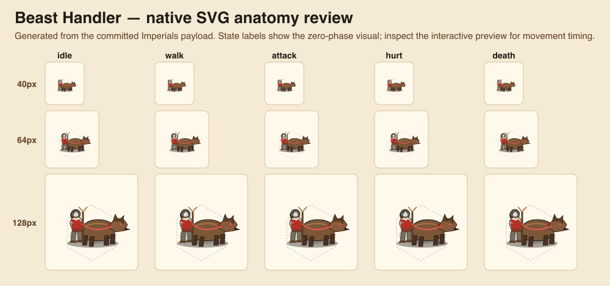
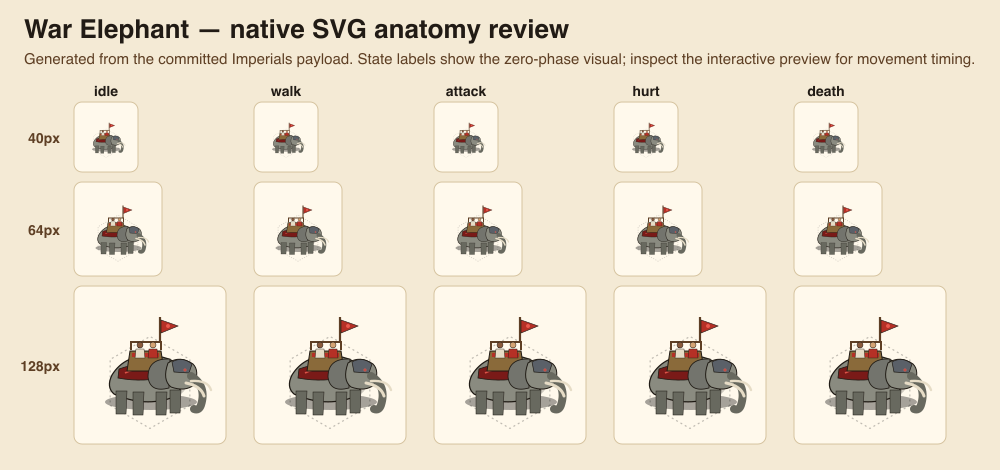
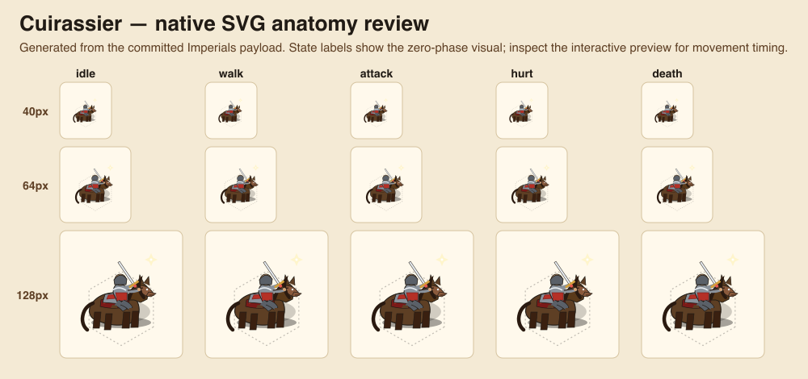

# Issue 708 visual review — readable mounted and beast formations

[Open the interactive sprite review](assets/issue-708/sprite-preview.html). It mounts the committed, generated native sprite output and provides all six faction palettes, idle/walk/attack/hurt/death states, and a reduced-motion toggle.

The sheets below are generated from that same committed Imperials payload at 40, 64, and 128 px. They record the zero-phase artwork only; use the interactive preview to assess motion timing.

## Beast Handler

The handler has two visible arms, two planted legs, and a forked staff held at hand height. The collared hound has a distinct head, ears, tail, and four independently animated legs; the leash joins the handler hand to the collar. The former target/sigil effect is gone.

## War Elephant

The elephant has a separate head, ear, forehead plate, trunk, tusks, and four legs. Its crew ride within the howdah; the rail-mounted standard moves with that howdah, never independently from the animal.

## Cuirassier

The horse has a readable head, muzzle, ears, mane, saddle, downward tail, and four gait legs. The cuirassier faces forward, straddles the saddle, holds reins with one hand, and carries the sabre with the other; the attack is a rider-led sabre action with a small impact spark.

## Review checklist

- The silhouettes remain identifiable at the 40 px map scale, without relying on labels.
- Walk cycles use a four-leg gait: the handler also walks, the elephant transfers weight, and the horse travels as a horse rather than a generic beast.
- Attack cycles animate the attacking body parts and legs: handler command/pounce, elephant charge, and mounted sabre strike.
- Palette tokens supply each civilisation colour; outline, metal, skin, and animal materials stay distinct.
- Selection, health, map/mobile scale, fog, and reduced motion continue to use the existing overlay contracts.
- No gameplay values, new mechanics, difficulty rules, AI behaviour, SFX, save data, solo play, or hot-seat state changes are introduced by this visual-only slice.

## Implementation notes

- Source pipeline: `units-v2.jsx` → serializer → generated faction modules → `v2/index.ts`. Generated modules are not hand-edited.
- The sprite design system remains the baseline: 128×128 view boxes, ink outlines, right-facing 2.5D silhouettes, palette-driven factions, named animation hooks, and static reduced-motion presentation.
- The review capture utility intentionally rasterizes the source SVG at zero phase. It is evidence of shipped anatomy rather than a substitute for CSS timing; the interactive review above is the timing proof.
