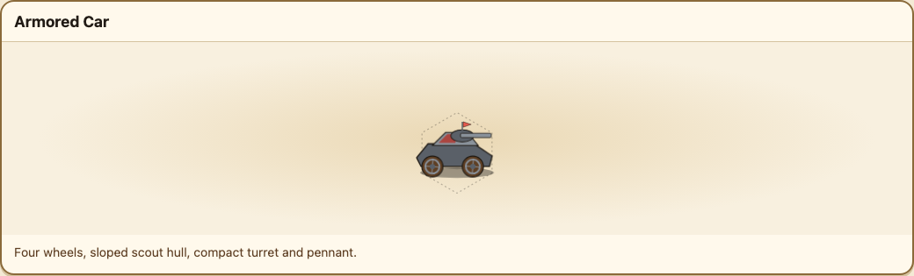
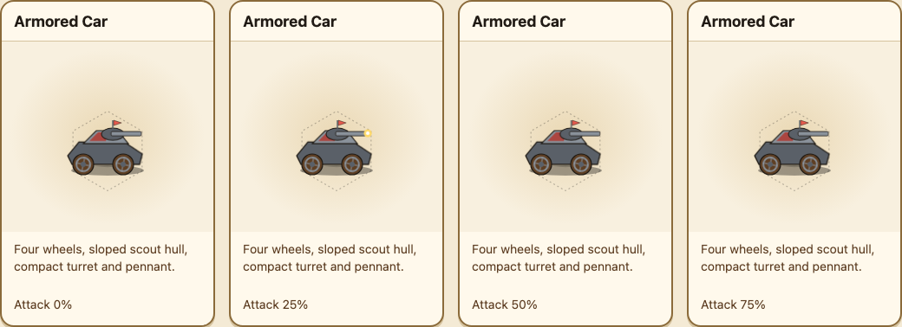
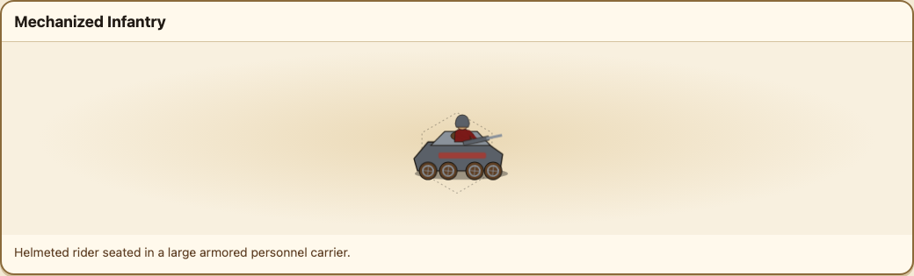
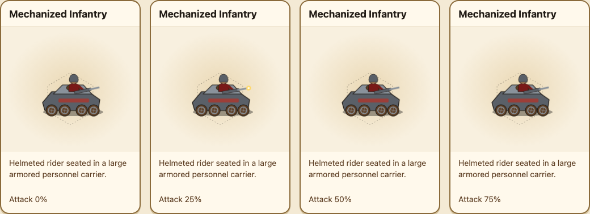
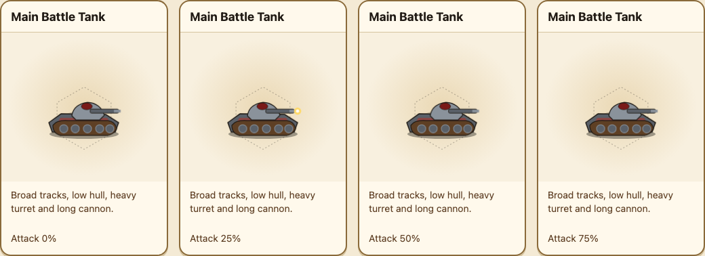

# Issue 709 visual review — industrial vehicles and anti-armor

[Open the interactive phase review](assets/issue-709/sprite-preview.html). It mounts the generated native SVG payload with the production CSS, six faction palettes, all lifecycle states, reduced motion, and paused 0/25/50/75% phase controls.

## Evidence

The identity sheets prove the committed zero-phase silhouettes at map scale. The phase-contact sheets prove that turret/cannon and rifle/hand attachment remain intact during the actual CSS attack timing.

## Review checklist

- Armored Car reads as fast wheeled reconnaissance, never a tracked tank.
- Mechanized Infantry reads as a helmeted rider seated inside a carrier that is visibly larger than them at 40px.
- Every walk state rolls wheels or tracks; every attack is local recoil and fire, with no humanoid gait or body lunge.
- Main Battle Tank is visibly heavier and later than the existing rhomboid Tank.
- Guns recoil as local mounts; no detached cannon, rifle, hand, or armor part appears at any sampled attack phase.
- Palette identity uses faction tokens while ink, metal, skin, and earth materials retain the shared design-system hierarchy.
- Reduced motion preserves the same static composition and information layers.
