# Issue 710 visual review — corrected native sprites

[Open the interactive review page](assets/issue-710/sprite-preview.html). It mounts the generated review-only native payloads with production CSS, all six faction palettes, lifecycle states, paused 0/25/50/75% phases, reduced motion, and the static SAM/Radar comparison. It also works directly from `file://`; no network, module, or sidecar payload is required.

Native lookup remains intentionally absent until the visual gate is accepted.

## Evidence

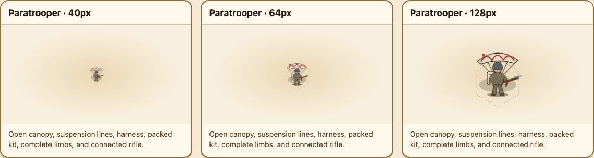
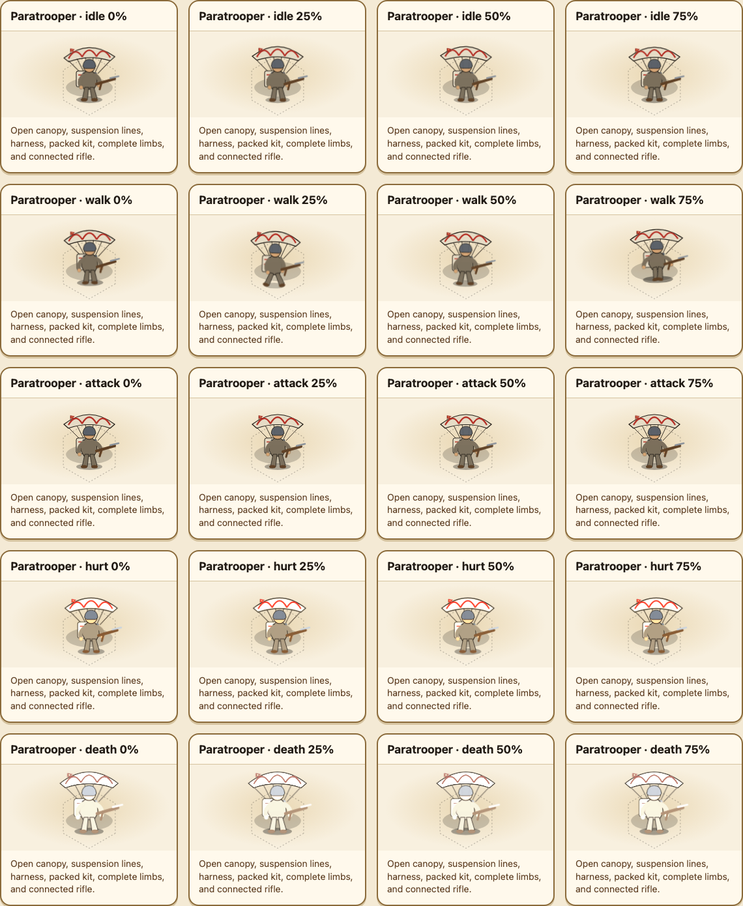
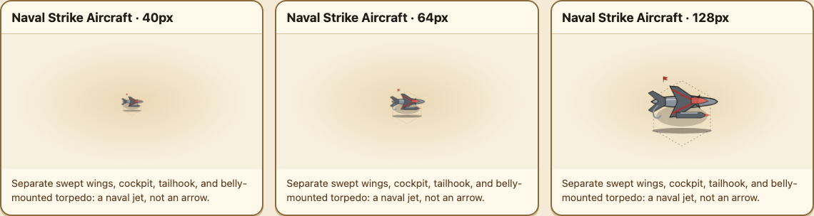
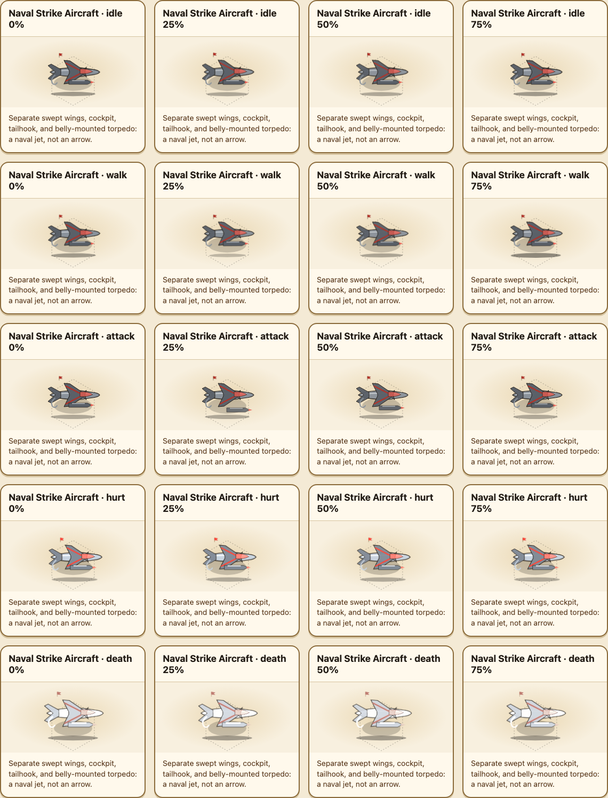
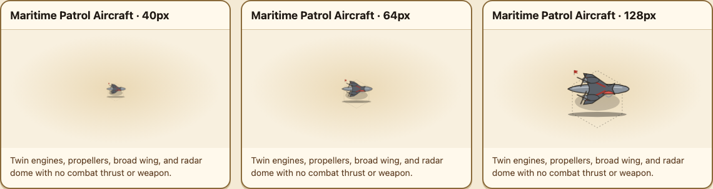
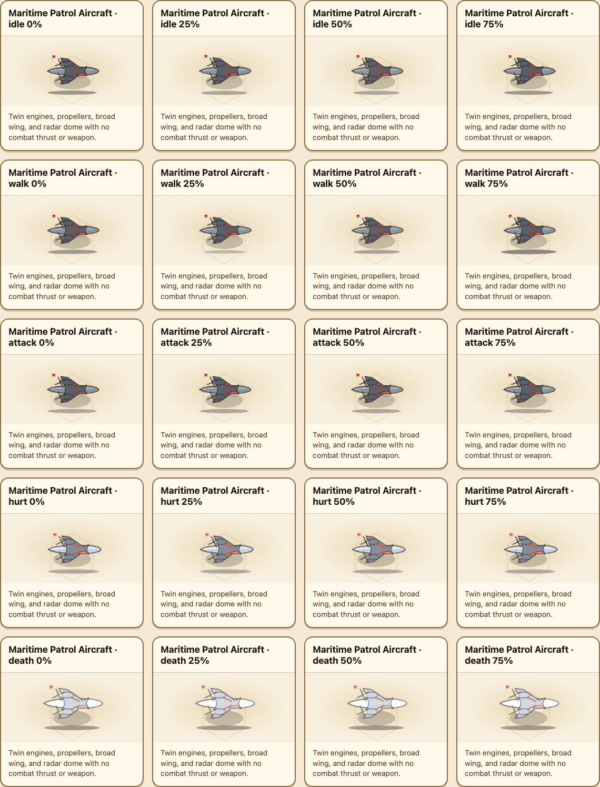
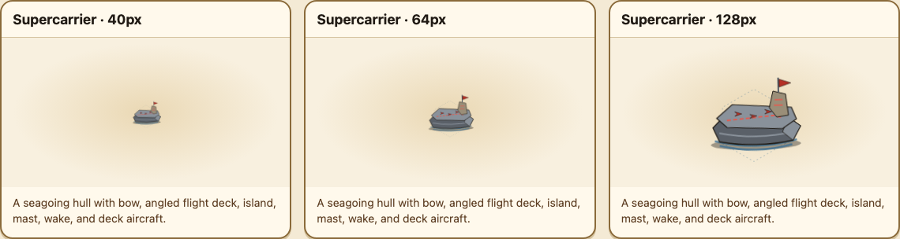
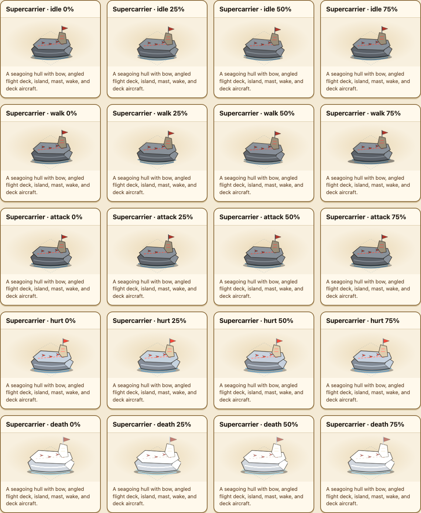
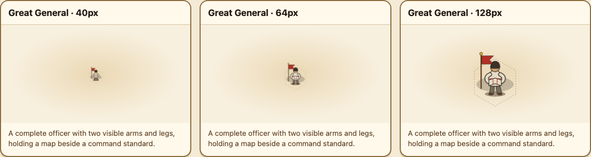
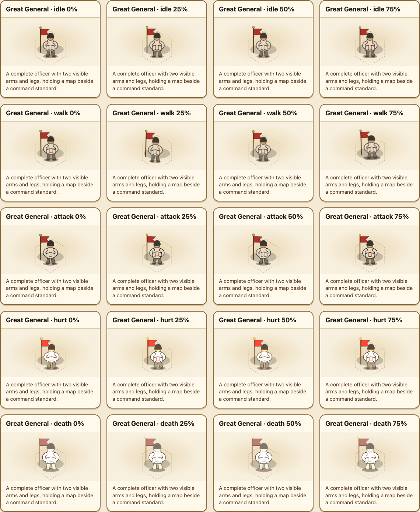
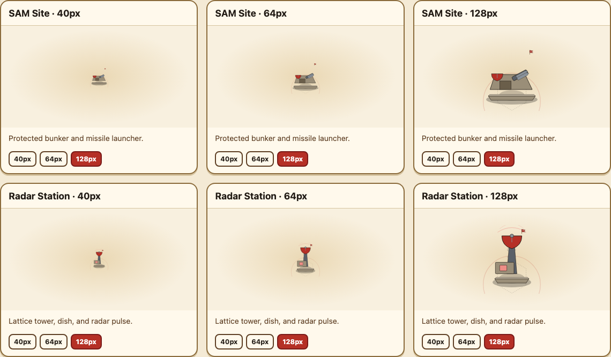

## Review checklist

- Paratrooper: an open canopy connects through visible suspension lines to harness and pack; both arms and legs are present, and the rifle stays in hand through every sampled phase.
- Naval Strike Aircraft: an elongated fuselage, cockpit, swept wings, tailhook, and belly torpedo read as a jet; attack releases the torpedo locally without a whole-plane thrust.
- Maritime Patrol Aircraft: long fuselage, paired nacelles and propellers, broad wing, and radar dome read as unarmed maritime surveillance; attack is only a local radar scan.
- Supercarrier: wake, hull, bow, tapered deck, deck aircraft, island, and mast make a boat at 40px; launch moves only the selected deck aircraft.
- Great General: the officer has clearly outlined arms and legs; both hands meet the unfolded map beside the standard, with no combat weapon or charge motion.
- Faction accents change banner, trim, payload, radar, deck, and command details while ink, metal, skin, and earth retain the design-system material hierarchy.
- Reduced motion keeps the same identity layers and disables motion only.
- SAM Site remains a protected bunker-and-launcher silhouette; Radar Station remains a lattice-tower-and-dish silhouette at 40px, 64px, and 128px.

## Gate status

Evidence generated and self-inspected on 2026-08-25. Awaiting explicit visual approval before importing these generated payloads into `src/renderer/sprites/v2/index.ts`.
