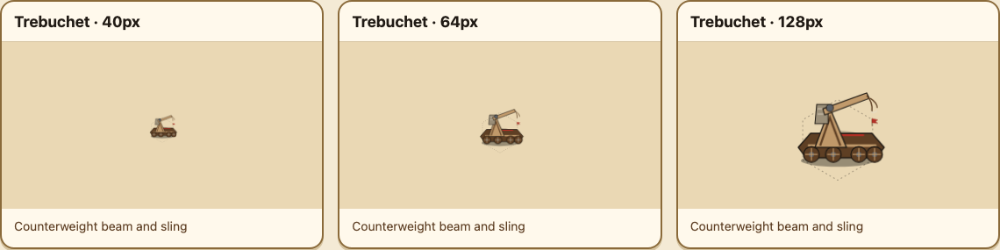
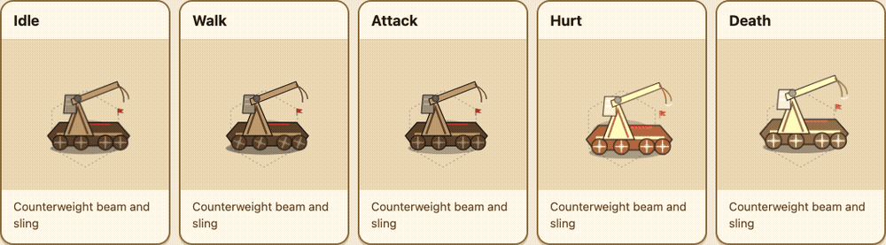
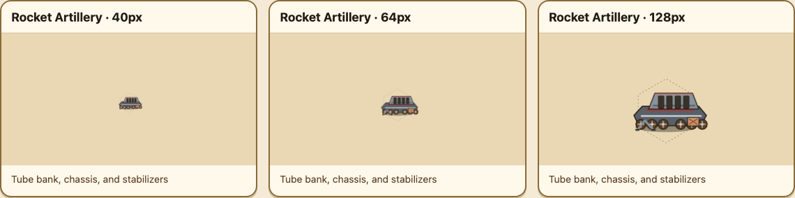
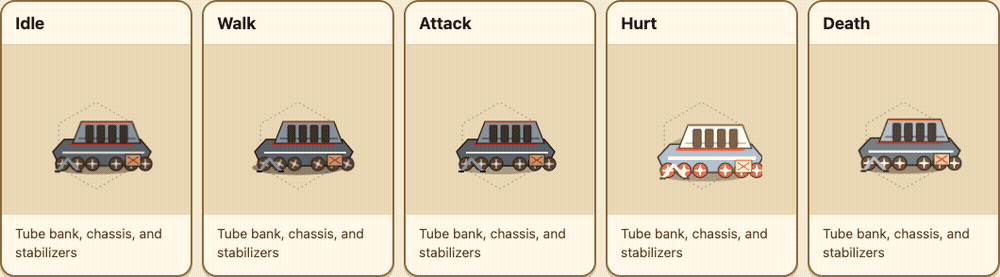
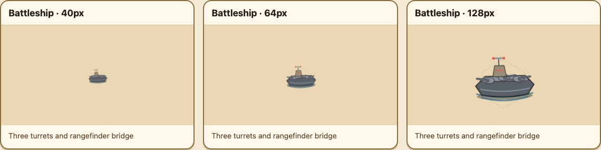
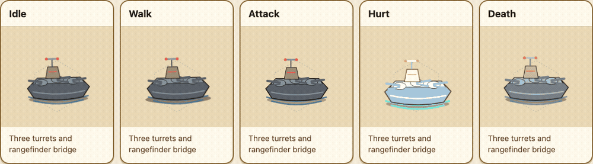
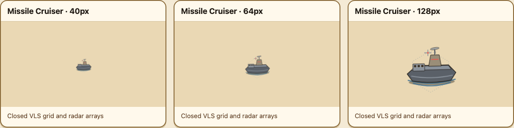
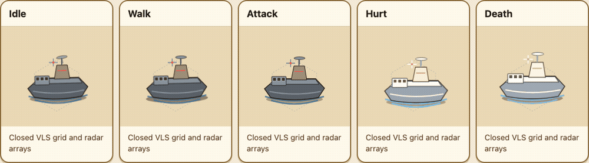

# Issue 711 — Remote Native Sprite Review

This page is the remote approval surface for the native Issue 711 sprites. All
evidence below is generated from the production V2 SVG payload and production
animation CSS; it does not use synthetic replacement art.

Each animation reel runs five left-to-right lanes in this order: **Idle**,
**Walk**, **Attack**, **Hurt**, and **Death**. The companion identity sheet
shows the same sprite at its actual 40px, 64px, and 128px map scales.

## Trebuchet

The siege engine reads as a wheeled A-frame with counterweight, beam, and an
empty sling. Its attack isolates motion to the beam and counterweight rather
than moving the carriage or adding a persistent projectile.

## Rocket Artillery

The six-wheel launcher uses a compact tube bank, stabilizers, and local tube
flash/recoil. It never uses a humanoid gait or a whole-vehicle attack lunge.

## Battleship

The capital ship is distinct through its three independent turrets and
rangefinder bridge. During attack, only the turrets recoil and flash.

## Missile Cruiser

The missile cruiser is defined by its closed VLS grid and paired radar arrays,
not by a battleship-style gun silhouette. Attack opens the VLS lids and briefly
shows launch indicators; idle keeps them closed.

## Approval

This review remains unapproved until a remote reviewer explicitly accepts the
embedded animation reels and map-scale identity sheets. The branch must remain
a draft pull request until that visual approval is recorded.
