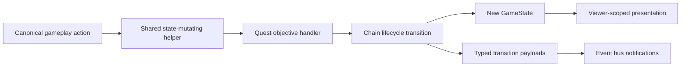

# Minor-Civilization Quest Chains Design

**Issue:** [#352](https://github.com/a1flecke/conquestoria/issues/352)
**Status:** Approved design
**Date:** 2026-06-12

## Summary

Minor civilizations currently issue isolated quests. This design adds one three-step, archetype-specific alliance chain for every minor-civilization archetype. A chain begins only after a major civilization completes a normal quest and the resulting relationship is Friendly (`30+`). Completing all three steps creates a durable alliance, floors the relationship at `60`, and activates the minor civilization's existing ally bonus.

The design is definition-driven, immutable, actor-attributed, viewer-scoped, era-aware, and target-aware. A quest must never ask for more valid targets than currently exist, reveal information the assigned player has not discovered, or grant progress for another civilization's action.

## Goals

- Add named, three-step chains for militaristic, mercantile, and cultural minor civilizations.
- Make archetype expansion compile- and test-enforced: adding an archetype without a chain must fail.
- Scale requirements by era while bounding them to live, player-known game conditions.
- Add a cultural `sponsor_festival` objective centered on patronage, exchange, and celebration rather than research.
- Make alliance durable across relationship loss but explicitly broken by war.
- Route gifts, festivals, trade routes, combat, camp destruction, war, and peace through canonical state-mutating helpers.
- Persist only authoritative chain state and normalize legacy saves safely.
- Prevent hot-seat information leaks and cross-player progress credit by construction.
- Show chain state, progress, rewards, expiration, and alliance state in the live diplomacy panel.

## Non-Goals

- Exclusive alliances. Multiple major civilizations may independently earn an alliance with the same minor civilization.
- New ally-bonus categories. Chain completion activates the issuing minor civilization's existing `allyBonus` definition.
- Consuming luxury resources during a festival. The festival checks access only.
- Broad new AI diplomacy strategy. AI receives a narrow chain-aware policy: it may pay an affordable assigned gift or festival, prioritize an assigned route destination, and otherwise earns military progress only from its ordinary legal actions.
- A generic workflow engine beyond minor-civilization quests.

## Core Invariants

1. A major civilization has at most one active quest from a given minor civilization.
2. An active chain is represented by the active quest's `chainId` and `stepIndex`; chain progress is not duplicated elsewhere.
3. `MinorCivState.activeQuests[majorCivId]` and the containing `minorCivId` are the authoritative assignment scope.
4. A bare `Quest` is never a public presentation or mutation boundary.
5. Actor-attributed objectives complete only from canonical action facts, never from a later snapshot scan.
6. Another actor may invalidate a target, but cannot receive or grant credit for the assigned actor.
7. Chain requirements are bounded to eligible, currently known targets. Hidden targets never affect visible counts or descriptions.
8. `expiresOnTurn` is inclusive: actions on that turn are valid; expiration occurs only when `currentTurn > expiresOnTurn`.
9. The source action is resolved before target invalidation or expiry reconciliation for that action.
10. State mutations and emitted transitions are produced together. Events notify; listeners do not mutate gameplay state.
11. Durable alliance is scoped to one `(majorCivId, minorCivId)` pair and does not leak bonuses or status to another player.

## Architecture

### 1. Runtime catalogs

`src/core/types.ts` will expose runtime tuples and derive their unions:

```ts
export const MINOR_CIV_ARCHETYPES = ['militaristic', 'mercantile', 'cultural'] as const;
export type MinorCivArchetype = typeof MINOR_CIV_ARCHETYPES[number];

export const QUEST_TYPES = [
  'destroy_camp',
  'gift_gold',
  'defeat_units',
  'trade_route',
  'sponsor_festival',
] as const;
export type QuestType = typeof QUEST_TYPES[number];
```

The runtime tuples give tests a canonical list. The derived unions prevent runtime and type catalogs from drifting.

### 2. Static chain definitions

`src/systems/quest-chain-definitions.ts` contains static data only:

```ts
export const QUEST_CHAINS_BY_ARCHETYPE = {
  militaristic: [MILITARY_ASSISTANCE_CHAIN],
  mercantile: [TRADE_PARTNERSHIP_CHAIN],
  cultural: [FESTIVALS_AND_EXCHANGE_CHAIN],
} satisfies Record<MinorCivArchetype, readonly QuestChainDefinition[]>;
```

Each chain definition contains:

- stable `id`
- player-visible `name` and `theme`
- exactly three step definitions
- preferred objective and ordered same-theme fallbacks per step
- era-scaling metadata
- step reward
- expiration duration

Definitions do not inspect `GameState`, mutate state, or emit events.

If an archetype later has multiple chains, definitions carry an explicit numeric `priority`. Eligibility checks chains by ascending priority and then stable ID, selecting the first chain whose Step 1 preferred or fallback objective is feasible. If none is currently feasible, the highest-priority chain becomes pending at Step 1. This keeps selection deterministic and avoids array-order accidents.

### 3. Objective handlers

`src/systems/quest-objective-system.ts` owns one exhaustive handler per `QuestType`:

```ts
interface QuestObjectiveHandler {
  createTarget(context: QuestGenerationContext, tuning: ObjectiveTuning): QuestTarget | null;
  validateTarget(context: QuestAssignmentContext): QuestTargetValidity;
  applyAction(context: QuestAssignmentContext, action: QuestAction): QuestActionResult;
  isComplete(context: QuestAssignmentContext): boolean;
  describe(context: QuestPresentationContext): string;
}
```

The registry uses `satisfies Record<QuestType, QuestObjectiveHandler>`. Adding a quest type without a handler fails TypeScript validation. The handler owns objective semantics; chain lifecycle code never branches on a step ID or parses quest prose.

### 4. Chain lifecycle

`src/systems/quest-chain-system.ts` is a pure transition layer. It decides:

- whether a completed normal quest qualifies to start a chain
- which chain applies to the issuer's archetype
- which objective variant is currently valid
- how a completed step advances
- how expiry, invalidation, war, peace, and final completion affect chain state
- the effective alliance and relationship label

It returns a new state fragment plus explicit typed transitions. It does not emit events or render UI.

### 5. Minor-civilization orchestration

`src/systems/minor-civ-system.ts` becomes the immutable orchestrator for minor-civilization quest and alliance state. It:

- threads a new `GameState` through turn processing
- applies quest rewards
- installs or removes active quests
- applies relationship changes and the final relationship floor
- applies ally bonuses through the effective-alliance helper
- converts chain transitions into event-bus notifications after state mutation

The touched quest, alliance-bonus, cooldown, and relationship-status paths must stop mutating the input state or using ad hoc `(mc as any)` fields.

### 6. Canonical action helpers

Gameplay sources call shared helpers with explicit actor and issuer scope:

- `performMinorCivGift(state, majorCivId, minorCivId, amount)`
- `performMinorCivFestival(state, majorCivId, minorCivId)`
- `applyQuestAction(state, action)` for route creation, unit defeat, and camp destruction facts
- `setMinorCivWarState(state, majorCivId, minorCivId, atWar)` for bilateral war and peace

`main.ts` and AI code delegate to these helpers. Event listeners remain presentation-only.



## Data Model

### Quest

```ts
export interface Quest {
  id: string;
  type: QuestType;
  description: string;
  target: QuestTarget;
  cityId?: string;
  reward: QuestReward;
  progress: number;
  status: 'active' | 'completed' | 'expired';
  turnIssued: number;
  expiresOnTurn: number | null;
  chainId?: string;
  stepIndex?: number;
}
```

`stepIndex` is zero-based in state and displayed as one-based. `chainNext` is removed from new code. Legacy JSON may contain `chainNext`; the loader ignores that extra field. `minorCivId` is removed from new quest state because it duplicates the containing `MinorCivState` key and can disagree with it.

Derived values such as chain name, step count, step title, and alliance reward are read from definitions and are not persisted.

### Festival target

```ts
type QuestTarget =
  | ExistingQuestTargets
  | { type: 'sponsor_festival'; amount: number; requiresLuxury: true };
```

The target deliberately does not name a specific luxury. At action time, any luxury returned by `getCivAvailableResources(state, majorCivId)` and classified as `type: 'luxury'` in `RESOURCE_DEFINITIONS` satisfies the access requirement. Access is not consumed.

### Chain status

```ts
export interface MinorCivChainStatus {
  chainId: string;
  status: 'pending' | 'allied' | 'broken';
  statusTurn: number;
  pendingStepIndex?: number;
  earnedTurn?: number;
}

export type MinorCivRelationshipStatus =
  | 'at-war'
  | 'hostile'
  | 'neutral'
  | 'friendly'
  | 'allied';

export interface MinorCivState {
  // existing fields
  activeQuests: Record<string, Quest>;
  chainStatusByCiv: Record<string, MinorCivChainStatus>;
  questCooldownUntilByCiv: Record<string, number>;
  lastNotifiedStatusByCiv: Record<string, MinorCivRelationshipStatus>;
}
```

`pending` means a specific next step is earned but no valid preferred or fallback objective can currently be created. `pendingStepIndex` and `pendingExpiresOnTurn` are required only for `pending`; the step is retried each turn for ten inclusive turns. Pending state suppresses normal quest generation and has no relationship penalty. If the retry window ends, pending state is removed and the standard cooldown begins so the pair cannot deadlock indefinitely. Active chain steps are represented only by `activeQuests[majorCivId]`. `allied` and `broken` cannot coexist with an active chain quest.

The typed cooldown and last-notified maps replace the existing `_cooldown_<civId>` and `_prevStatus` dynamic properties.

## Era Scaling And Feasibility

### Base tuning

| Era | Base gold | Preferred military count | Grand Festival gold | Quest duration |
|---|---:|---:|---:|---:|
| 1 | 25 | 1 | 50 | 20 turns |
| 2 | 50 | 2 | 100 | 20 turns |
| 3 | 75 | 3 | 150 | 20 turns |
| 4 | 100 | 4 | 200 | 20 turns |

Fallback contribution multipliers are `1.25x` for Step 2 and `1.5x` for Step 3, rounded up to the nearest `5` gold.

Gold feasibility uses one shared projection. `calculateCivEconomy(state, majorCivId).netGoldPerTurn` supplies the current net rate. A contribution is eligible only when:

```text
currentGold + max(0, netGoldPerTurn) * questDuration >= requiredGold
```

This is an opportunity check, not a reservation: later player spending may still delay execution. The action itself requires the full amount in the current treasury. If neither the preferred objective nor a fallback passes its live feasibility check, the earned step becomes pending instead of presenting an impossible requirement.

### Valid military targets

A military target is eligible only when all are true:

- it is within the step's radius of the issuing minor civilization's city
- its tile is currently visible to the assigned major civilization; previously explored but currently hidden units or camps are not counted
- the shared combat-legality helpers consider the unit or camp a valid hostile target for that major civilization
- it is not owned by the issuing minor civilization

The requested unit count is `min(preferredEraCount, eligibleKnownCount)`. A quest is never generated with zero targets or with a count greater than the eligible known count.

### Valid trade-route targets

A route objective is preferred only when the assigned civilization can realistically pursue a new route to the issuing city:

- the `trade-routes` technology is complete
- the issuing city is discovered
- the civilizations are not at war and route diplomacy permits the destination
- at least one owned origin city has available route capacity
- a land path exists for the existing caravan route implementation
- an uncommitted caravan exists, or an owned city can finish one after its existing queue within the objective's remaining turns

Production feasibility uses the same production-per-turn calculation as the city UI, includes queued work ahead of the caravan, and rejects a route objective when the projected completion plus route establishment cannot fit inside the deadline. This check is shared by normal quest generation, chain generation, AI guidance, and UI wording. Before those conditions hold, the chain uses its same-theme patronage fallback.

### Target changes

- If a specific camp disappears because the assigned player destroyed it, the source action completes that objective before reconciliation.
- If another actor destroys the camp while its tile is currently visible to the assignee, the assigned quest retargets to another eligible known camp, then to the step's same-theme fallback. If the tile is hidden, the assignment remains based on remembered intel until the assignee can observe that it is stale; hidden world changes do not leak through quest state.
- For `defeat_units`, the issued count is fixed. Visibility loss alone never rewrites an active objective. Actor-attributed defeats advance every independently valid issuer assignment whose stored radius and hostility rules match that defeat; this intentional shared credit is covered by a balance regression.
- A trade objective created under valid conditions remains active while it is reasonably recoverable. War with the issuer clears it through the war transition. Destruction of the issuer cancels it without penalty.
- A Grand Festival remains valid while the player has any accessible luxury. If all luxury access disappears, the step changes to its Festival Preparations fallback. If that fallback cannot be created, the chain is cancelled without penalty.
- Retargeting or fallback replacement emits one owner-targeted notification and updates the open panel immediately.

## Chain Definitions

Every chain has three playable steps. Step rewards are `+15`, `+20`, and `+25` relationship respectively. Final completion applies the Step 3 reward, then floors the relationship at `60`, marks the durable alliance, and activates the issuer's existing ally bonus.

### Military Assistance

| Step | Title | Preferred objective | Ordered fallback |
|---|---|---|---|
| 1 | Remove the Immediate Threat | Destroy the nearest eligible known camp within radius 8 | Defeat one eligible known hostile within radius 8; then fund defenses for `1.0x` base gold |
| 2 | Secure the Approaches | Destroy another eligible known camp within radius 10 | Defeat up to the era military count within radius 10; then fund reinforcements for `1.25x` base gold |
| 3 | Stand With Us | Defeat up to the era military count within radius 10 | Destroy an eligible known camp; then mobilize defenses for `1.5x` base gold |

The funding fallbacks use the existing `gift_gold` objective with military step prose. No step names or counts imply a number of neighboring civilizations.

### Trade Partnership

| Step | Title | Preferred objective | Ordered fallback |
|---|---|---|---|
| 1 | Demonstrate Good Credit | Contribute `1.0x` base gold when the shared gold projection can reach it | Enter pending until the contribution is feasible |
| 2 | Open an Exchange | Establish a new route to the issuing city after the step is issued | Finance a merchant delegation for `1.25x` base gold |
| 3 | Secure the Partnership | Establish another new route when another route is feasible | Capitalize the partnership for `1.5x` base gold |

An existing route never retroactively completes a step. Step 3 route feasibility is recalculated after the Step 2 route consumes capacity.

### Festivals And Exchange

| Step | Title | Preferred objective | Ordered fallback |
|---|---|---|---|
| 1 | Era 1: Honor the Storytellers; Era 2: Patronize Local Arts; Era 3: Convene Philosophers; Era 4: Commission the Great Stage | Contribute `1.0x` base gold with era-specific cultural prose | Enter pending until patronage is feasible |
| 2 | Era 1: Host a Seasonal Fair; Era 2: Exchange Artisans; Era 3: Welcome a Cultural Delegation; Era 4: Open an Exchange Route | Sponsor an era-scaled festival when luxury access exists; in Era 4 prefer a new route to the issuer | Fund the corresponding cultural delegation for `1.25x` base gold |
| 3 | Era 1: Feast of First Songs; Era 2: Festival of Crafts; Era 3: Festival of Ideas; Era 4: Grand Festival | Pay the era's festival amount while currently having access to any luxury | Fund named festival preparations for `1.5x` base gold if luxury access or the larger contribution is not feasible |

The chain definition stores all four era variants explicitly. Tests assert titles and preferred objectives for every era, so adding an era or changing an era boundary cannot silently collapse cultural play back into generic research or commerce wording.

The Grand Festival is a new `sponsor_festival` objective. It is an atomic action: validation occurs first, then gold is deducted, then the quest completes. Luxury access is checked but not consumed. The fallback remains cultural patronage and does not masquerade as a Grand Festival.

## State Machine

### Normal quest to chain

1. Complete a normal quest from the minor civilization.
2. Apply the normal quest reward first.
3. Recalculate the relationship from the resulting state.
4. If the relationship is at least `30`, the civilizations are not at war, and the pair is not currently allied, choose the issuer's archetype chain.
5. Create Step 1 immediately when a preferred or fallback objective is valid.
6. Otherwise store `pending` with `pendingStepIndex: 0` and retry Step 1 each turn. Do not issue normal quests while pending.

### Step progression

1. A canonical action completes the current step.
2. Apply that step's reward exactly once.
3. Mark the completed quest only in the transition payload; do not retain it as active state.
4. Generate the next step against the post-reward state.
5. If a preferred or fallback objective is valid, replace the active quest atomically in the same state update, with no normal cooldown.
6. If no objective is valid, remove the completed quest and store `pending` with the next step index. Do not apply a cooldown or issue a normal quest.
7. Emit a completion transition followed by either an issuance or pending transition.

### Final completion

1. Apply the Step 3 reward.
2. Set the relationship to `max(currentRelationship, 60)`.
3. Remove the active quest.
4. Store `{ status: 'allied', chainId, statusTurn, earnedTurn }`.
5. Emit alliance-earned exactly once.

### Expiry

On `currentTurn > expiresOnTurn`:

- remove the active chain quest
- remove in-progress chain state
- apply the standard `-5` relationship penalty
- set the normal three-turn quest cooldown
- emit chain-expired once
- require a future qualifying normal quest completion to restart from Step 1

### Target invalidation

When another actor or world change makes the current objective impossible:

- retarget within the same objective when possible
- otherwise replace it with the step's ordered same-theme fallback
- otherwise cancel the chain without a relationship penalty
- apply the normal three-turn cooldown after cancellation
- emit one owner-targeted retarget or cancellation transition

### War and peace

Declaring war through `setMinorCivWarState` is bilateral and atomic.

- Clear any pending or active chain for that pair immediately.
- If an alliance had been earned, replace `allied` with `broken` and emit alliance-broken exactly once.
- If no alliance had been earned, remove chain status instead of inventing a broken alliance.
- Do not apply the quest-expiry relationship penalty.
- Set `questCooldownUntilByCiv[majorCivId] = currentTurn + 3` so immediate peace cannot issue a quest in the same turn.
- Suppress normal and chain quests while at war.

Making peace is also bilateral. It does not restore an alliance. Normal quests resume after the standard cooldown. Once a normal quest completion leaves the relationship at `30+`, the chain restarts at Step 1, replacing `broken` with the new active or pending chain.

All hostile entry paths use this lifecycle. Attacking a minor-civilization unit or assaulting its city first establishes bilateral war through the canonical helper. Neutral or allied minor-civilization units are not legal combat targets until that transition succeeds, and declaring war breaks an earned alliance before combat or conquest resolves.

### Minor civilization destruction

Destroying the issuer clears all of its quests and chain statuses, disables its ally bonuses, and sends independently redacted destruction notifications. Active chains are cancelled without penalty because completion is no longer possible.

```mermaid
stateDiagram-v2
  [*] --> NormalQuests
  NormalQuests --> PendingStep: qualifying reward, no valid Step 1
  NormalQuests --> Step1: normal quest reward leaves relationship >= 30, valid Step 1
  PendingStep --> Step1: pending Step 1 becomes valid
  Step1 --> Step2: complete, next objective valid
  Step1 --> PendingStep: complete, Step 2 not yet valid
  PendingStep --> Step2: pending Step 2 becomes valid
  Step2 --> Step3: complete, next objective valid
  Step2 --> PendingStep: complete, Step 3 not yet valid
  PendingStep --> Step3: pending Step 3 becomes valid
  Step3 --> Allied: complete, relationship floor 60
  Step1 --> Cooldown: expiry or no-target cancellation
  Step2 --> Cooldown: expiry or no-target cancellation
  Step3 --> Cooldown: expiry or no-target cancellation
  PendingStep --> AtWar: declare war
  Step1 --> AtWar: declare war
  Step2 --> AtWar: declare war
  Step3 --> AtWar: declare war
  Allied --> BrokenAtWar: declare war
  AtWar --> NormalQuests: make peace
  BrokenAtWar --> NormalQuests: make peace; alliance remains broken
  NormalQuests --> Destroyed: issuer destroyed
  PendingStep --> Destroyed: issuer destroyed
  Step1 --> Destroyed: issuer destroyed
  Step2 --> Destroyed: issuer destroyed
  Step3 --> Destroyed: issuer destroyed
  Allied --> Destroyed: issuer destroyed
  Cooldown --> NormalQuests: cooldown reached
  Destroyed --> [*]
```



## Effective Relationship And Ally Bonuses

`getMinorCivRelationshipStatus(state, majorCivId, minorCivId)` is the single status helper used by systems and UI.

Priority:

1. `atWarWith` -> `at-war`
2. chain status `allied` -> `allied`, regardless of raw relationship score
3. raw relationship `<= -60` -> `hostile`
4. raw relationship `>= 30` -> `friendly`
5. otherwise -> `neutral`

Raw relationship `>= 60` alone no longer grants `allied`. This prevents Step 1 or Step 2 rewards from activating the permanent bonus before the chain is complete. `broken` also suppresses score-based alliance until the chain is re-earned.

`isMinorCivAllianceActive` requires:

- the minor civilization exists and is not destroyed
- the pair's chain status is `allied`
- the pair is not at war

`applyAllyBonuses` uses this helper instead of `relationship >= 60`. It copies every mutated civilization, city, unit roster, counter, or research state rather than writing through the input state.

Every consumer that describes or reacts to a minor-civilization ally uses the same helper, including diplomacy rows, advisor triggers, council cards, notifications, and bonus application. No UI or guidance path may infer alliance from raw relationship.

## Action Attribution

`QuestAction` is a discriminated union carrying explicit facts:

- gift: actor, issuer, amount
- festival: actor, issuer
- route created: actor, origin city, destination city, route ID
- unit defeated: actor, defeated owner, position, unit ID
- camp destroyed: actor, camp ID, position

Credit rules:

- Select only `minorCiv.activeQuests[action.actorCivId]` for positive progress.
- Match the containing `minorCivId`, objective type, target, spatial boundary, and action turn.
- A route counts only when the origin city's owner is the assigned major and the destination is the issuer's city. `foreignCivId` alone is insufficient.
- A unit defeat counts only when the canonical combat result credits the assigned major and the defeated unit was a legal hostile inside the stored radius.
- A camp counts only when the canonical camp-destruction helper credits the assigned major and the camp ID matches.
- A gift or festival validates the supplied actor and issuer, current treasury, active assignment, and objective requirements before mutation.
- `state.currentPlayer` is never consulted in system code.
- One defeat or camp destruction may advance more than one issuer only when every assignment independently matches the same actor, visibility or remembered-intel rule, hostility, target, and radius. No reward is shared merely because quest types match.

An invalidation reconciliation pass may inspect other assignments affected by a removed target, but it may only retarget or cancel them. It cannot award progress.

## Privacy And Viewer Scoping

### Authoritative ownership

Quest assignment is normalized, not duplicated:

```text
state.minorCivs[minorCivId].activeQuests[majorCivId]
```

Public mutation and presentation APIs require both IDs. No exported helper accepts a caller-provided quest and viewer without verifying the assignment container.

### Viewer projection

Replace naked quest presentation calls with:

```ts
getMinorCivQuestPresentationForPlayer(state, viewerCivId, minorCivId)
```

The helper:

- returns `null` unless the viewer has discovered the issuer
- reads only `activeQuests[viewerCivId]`
- reads only `chainStatusByCiv[viewerCivId]`
- describes targets using the viewer's discovery and visibility state
- never returns another player's quest, pending state, progress, alliance, target identity, or resource information

Quest candidate generation also filters against the assigned player's known information. A quest may not disclose an unseen camp, unit, city, owner, resource, or target count. If a future feature intentionally grants issuer-provided intelligence, it must create an explicit viewer-scoped intel record and map affordance; quest prose alone is not an intel grant.

### Notifications

- Player-specific transition payloads include `majorCivId` and `minorCivId`.
- Notification formatters return `null` unless `viewerCivId === majorCivId` and the issuer is known.
- Listeners route by the explicit major civilization ID and never by `state.currentPlayer`.
- Hot-seat queues and logs are stored per recipient.
- Global events such as evolution or destruction are formatted independently for every viewer and remain redacted when unknown.
- Alliance earned, alliance broken, pending, retarget, cancellation, progress, completion, issuance, and expiry messages are owner-only.

### Resource privacy

Festival validation reads only `getCivAvailableResources(state, assignedMajorCivId)`. It filters that set through public resource definitions and does not inspect or reveal another civilization's holdings or seller identity. The UI says "Requires access to any luxury" rather than exposing hidden acquisition details.

## Player Experience

The existing live surface is `src/ui/diplomacy-panel.ts`.

For an active chain it shows:

- chain name
- `Step N of 3`
- step title and viewer-safe objective description
- numeric progress when relevant
- turns remaining, including `0 turns` on the still-valid expiration turn
- current step reward
- final reward: durable alliance plus the issuer's ally bonus description

Other states:

- pending: the chain name, the pending step number, and "Waiting for a valid opportunity."
- allied: "Durable Alliance" plus the active ally bonus
- broken after peace: "Alliance broken; complete a new quest at Friendly standing to rebuild trust."
- at war: no quest or chain solicitation

Actions:

- The gift button uses the active gift target amount when applicable; otherwise it retains the normal gift action.
- `Sponsor Grand Festival` appears only for the assigned player's active festival objective.
- The festival action displays the gold and luxury requirements and is disabled with a specific reason when either requirement is unmet.
- All new buttons use `createGameButton` and retain 44-pixel touch targets.
- Gift, festival, war, and peace actions rerender the still-open diplomacy panel immediately from the resulting state.

### Player truth table

| Before | Action | Internal result | Immediate visible result |
|---|---|---|---|
| Normal quest, relationship 25 | Complete quest for +10 relationship | Reward applied, Step 1 issued | Panel shows chain name and `Step 1 of 3` |
| Step 1 gift is active | Pay the required gift | Gold deducted, reward applied, Step 2 installed | Same panel shows Step 2 objective and reward |
| Grand Festival requirements met | Tap `Sponsor Grand Festival` | Gold deducted, festival completes, relationship floored to 60, alliance stored | Panel shows Durable Alliance and ally bonus |
| Grand Festival luxury access expired | Turn/action reconciliation runs | Objective becomes Festival Preparations fallback | Panel and notification show the replacement objective |
| Active chain expires after its inclusive final turn | Advance turn | Chain removed, -5 relationship, cooldown stored | Panel returns to no active chain and notification explains reset |
| Durable alliance exists at relationship 20 | Relationship penalty occurs | Raw score changes only | Panel still shows Durable Alliance; bonus remains active |
| Durable alliance exists | Declare war | Bilateral war, alliance becomes broken, quest cleared | Panel shows At War; bonus stops |
| Broken alliance, then peace | Make peace | Bilateral peace; broken status remains | Panel shows non-allied relationship and rebuild guidance |
| Player A and B share the same issuer | Player A completes an objective | Only A's assignment transitions | A sees progress; B's panel and log are unchanged |

### Misleading UI risks

- `Allied` must not be derived from raw relationship `>= 60`.
- `Step N of 3` must come from validated definition metadata, not stale persisted counts.
- A route objective must not appear when the shared feasibility helper says the route is unavailable.
- A military count must not include hidden, neutral, issuer-owned, or otherwise illegal targets.
- A festival action must not appear for another player's quest or imply a luxury will be consumed.
- A pending chain must not look like an active actionable quest.
- A retargeted objective must replace stale description, progress boundary, and action controls in the same render.

## Persistence And Normalization

New-game and evolved-camp creation initializes the three new `MinorCivState` maps.

`normalizeLoadedState` performs these legacy-safe defaults:

- missing `chainStatusByCiv` or `questCooldownUntilByCiv` -> empty object
- missing `lastNotifiedStatusByCiv` -> initialize each known major to its current effective non-transitioning status, preventing migration-time notification bursts
- quests without `chainId` and `stepIndex` -> normal quests
- legacy `chainNext` and `minorCivId` fields -> ignored
- a quest with unknown chain ID, out-of-range step index, or mismatched objective type -> cancel without penalty and apply the standard cooldown
- pending/allied/broken entries with an unknown chain ID -> remove

Quest IDs must remain unique after load. `scanIdCounters` currently scans `Object.keys(activeQuests)`, which are major-civilization IDs. It must instead scan `Object.values(activeQuests).map(quest => quest.id)`, with a regression proving the next generated quest ID exceeds every nested quest ID.

Round-trip tests serialize and reload active Step 1, Step 2, Step 3, pending, allied, broken, cooldown, and festival state.

## Transition Events

Existing quest events remain, with chain metadata available through the quest snapshot. Add focused events for states that cannot be represented accurately by the old set:

- `minor-civ:quest-progressed`
- `minor-civ:quest-retargeted`
- `minor-civ:quest-cancelled`
- `minor-civ:quest-chain-pending`
- `minor-civ:alliance-broken`

`minor-civ:allied` is emitted only when a chain's final step earns the durable alliance, not when raw relationship happens to cross `60`.

Every event is emitted from the explicit transition returned by the mutating helper. Pure gameplay helpers never emit before their returned state is installed. The live caller assigns the new state first and only then passes transitions to the notification adapter, so listeners and hot-seat queues always observe and mutate the authoritative object. Repeated turn processing, rendering, loading, or steady-state scans must not emit the same one-time transition again.

## Testing Strategy

### Definition completeness

- `QUEST_CHAINS_BY_ARCHETYPE` has exactly the keys in `MINOR_CIV_ARCHETYPES`.
- Every archetype has at least one non-empty, exactly three-step chain.
- Every archetype used by `MINOR_CIV_DEFINITIONS` has a chain.
- Every chain ID is unique.
- Multiple-chain selection follows explicit priority and stable ID rather than declaration order.
- Every preferred and fallback objective has a registered handler.
- Adding a new archetype without updating the chain registry fails TypeScript and the runtime catalog test.

### Objective and feasibility tests

- Military counts are bounded at every era and never exceed eligible known targets.
- Hidden or non-hostile units and camps do not affect targets or descriptions.
- With one eligible target, a request for three becomes one.
- With no preferred military target, the correct same-theme fallback is generated.
- Trade routes are preferred only when the shared feasibility conjunction is fully true.
- Negative trade tests cover each missing condition independently: tech, discovery, diplomacy, capacity, path, and caravan/trainability.
- Festival requires both sufficient gold and at least one accessible luxury.
- Gold without luxury and luxury without gold are both insufficient.
- Owned/improved, city-center, outpost, and unexpired purchased luxury access each qualify.
- Strategic resources do not qualify; expired purchased access does not qualify.
- Festival completion does not remove or alter resource access.

### State-transition tests

- Normal reward is applied before Friendly eligibility is evaluated.
- A qualifying completion issues Step 1 immediately or enters pending with step index 0.
- Step 1 and Step 2 completion atomically install the next step when valid, or persist that next step's pending index with no cooldown.
- Step 3 applies its reward, floors relationship at 60, removes the quest, and stores allied.
- Repeated processing does not duplicate rewards, steps, or events.
- An action on `expiresOnTurn` completes; the same quest expires on the following turn.
- Expiry applies -5, resets to Step 1, and starts the standard cooldown.
- Other-actor invalidation retargets, falls back, or cancels without awarding credit or applying -5.
- War clears pending and active chains. Earned alliance becomes broken; unearned chains do not.
- Peace does not restore alliance.
- A post-peace qualifying normal quest restarts from Step 1.
- Relationship loss without war preserves earned alliance and ally bonus.
- Raw relationship 60 without final chain completion does not grant Allied status or bonuses.
- Destroyed issuers cannot retain quests, alliance bonuses, or pending chains.

### Actor parity and attribution

- Human and AI camp destruction use the same progress helper.
- Human and AI combat kills use the same progress helper.
- Route establishment credits only the origin owner and exact issuer city.
- Player A's gift, route, kill, camp destruction, or festival never advances Player B's identical quest.
- Another player's target removal can invalidate B's quest but cannot complete it.
- Progress is not reconstructed by observing a missing camp or final state.

### Privacy and hot-seat tests

- A viewer who has not discovered the issuer sees no quest or chain details.
- Two players who discovered the same issuer see only their own assignment, progress, pending status, alliance, and notifications.
- A's resources cannot satisfy or describe B's festival.
- Hidden targets and hidden target counts never appear in descriptions.
- Owner-targeted notifications are absent from other players' queues and logs.
- Global evolution/destruction notifications independently redact each viewer's presentation.
- Alliance bonuses apply only to the civilization that earned them.

### UI tests

- Active chain renders chain name, step number, objective, progress, turns left, current reward, and final ally bonus.
- Pending, allied, broken, and at-war states render distinct guidance.
- Gift and festival clicks rerender the open panel to the next state immediately.
- Festival button presence and disabled reasons match the active viewer's requirements.
- Retargeting updates visible objective text and controls.
- The final valid turn displays correctly and does not claim the quest has expired early.
- Reopening the panel after a player handoff uses the new `state.currentPlayer` and reveals no previous-player state.

### Persistence tests

- JSON round trip preserves `chainId`, `stepIndex`, chain status, cooldown, and festival targets.
- Legacy saves receive empty typed maps and retain normal quests.
- Invalid chain metadata is cancelled safely without a reward or penalty.
- ID-counter migration scans nested quest values, not assignment keys.

## Verification

Implementation must run:

- `scripts/check-src-rule-violations.sh` for every changed `src/` file
- all mirrored and directly relevant system, storage, UI, AI, and turn-manager tests in one targeted Vitest command where practical
- `./scripts/run-with-mise.sh yarn build`
- `./scripts/run-with-mise.sh yarn test`

The final review must inspect both `git diff origin/main...HEAD` and the uncommitted `git diff`, including full source diffs when either contains source changes.

## Expected File Boundaries

- `src/core/types.ts`: runtime catalogs, quest target and metadata, chain state, events
- `src/systems/quest-chain-definitions.ts`: static chain data and tuning
- `src/systems/quest-objective-system.ts`: objective registry and typed action matching
- `src/systems/quest-chain-system.ts`: pure chain lifecycle and effective alliance helpers
- `src/systems/quest-system.ts`: normal quest generation delegating to objective handlers
- `src/systems/minor-civ-system.ts`: immutable orchestration, rewards, bonuses, transitions
- `src/systems/barbarian-system.ts`, combat resolution path, and `src/systems/trade-system.ts`: canonical action-fact wiring
- `src/storage/save-manager.ts`, `src/core/id-counters.ts`: normalization and stable quest IDs
- `src/systems/quest-presentation.ts`: viewer-scoped quest projection
- `src/ui/diplomacy-panel.ts`: chain presentation and festival action
- `src/ui/minor-civ-notifications.ts` and listeners: targeted transition messaging
- `src/main.ts`: delegation only; no quest or chain mutation
- mirrored tests under `tests/`

This separation keeps definition data, objective semantics, lifecycle policy, canonical mutation, and viewer presentation independently understandable and testable.
