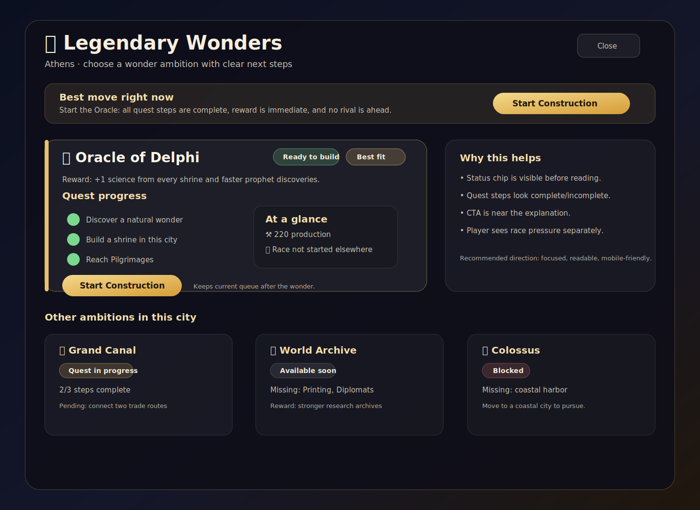
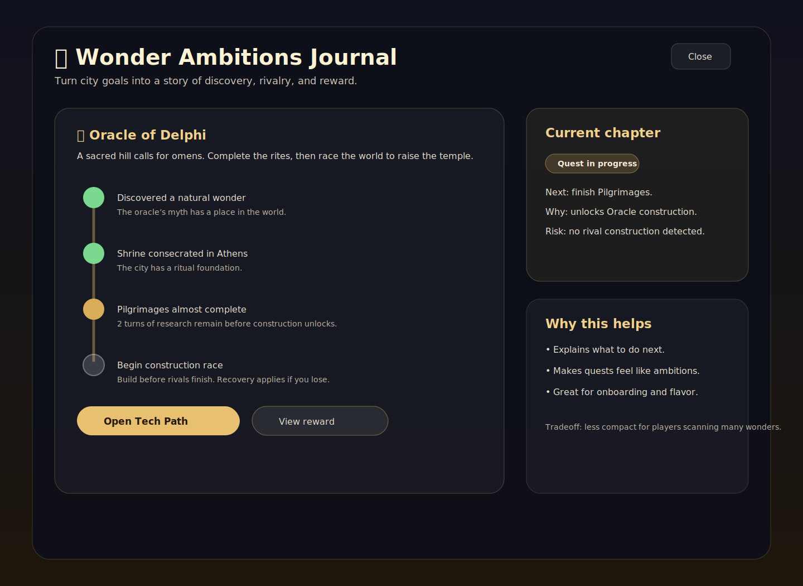
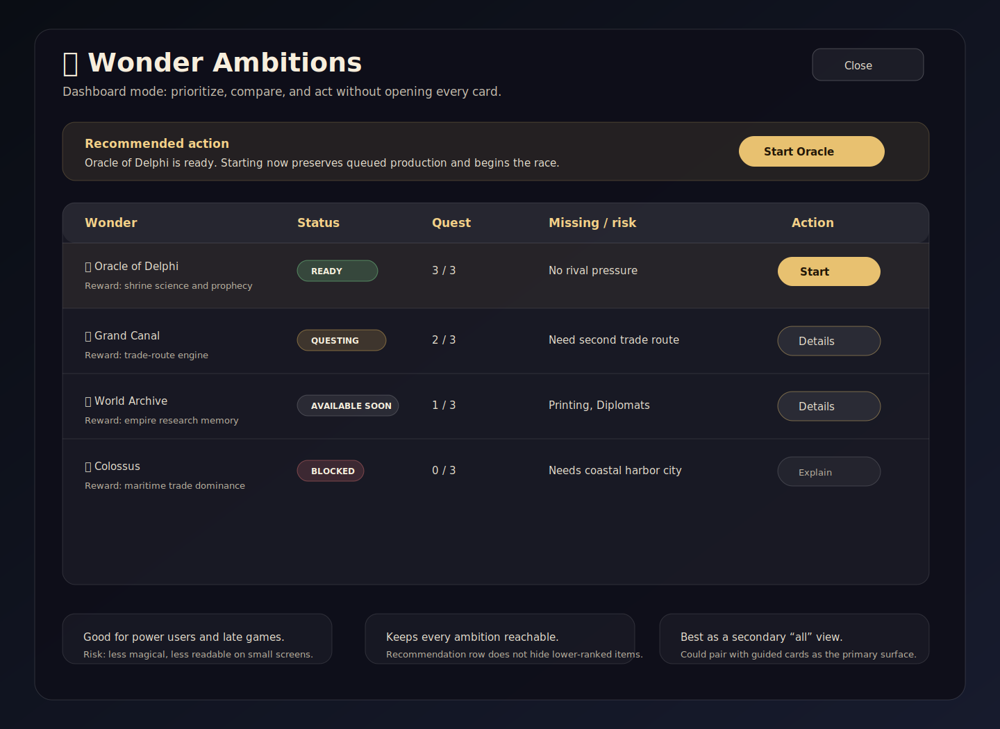

# Issue #396 Wonder Ambitions UI Brainstorm

Status: visual brainstorm. The selected implementation direction is captured in `2026-06-26-issue-396-wonder-ambitions-ui-design.md`.

Issue: <https://github.com/a1flecke/conquestoria/issues/396>

## Problem

The current Wonder Ambitions panel reads like an unstyled rules dump. It uses bare text blocks for status, quest steps, requirements, rewards, and race state, so the player has to parse every paragraph before knowing what to do. It also visually diverges from newer game panels that use status chips, icon-led copy, styled cards, and clear action buttons.

## Visual directions

### Option A — Guided cards

Make the screen a guided decision surface. The top area answers “what is the best move right now?” and the primary card uses a status chip, quest checklist, reward summary, race context, and nearby CTA. Lower-ranked ambitions remain reachable as smaller cards.

Why it is promising:

- Best fit for mobile and touch.
- Gives one clear recommendation without hiding the full catalog.
- Maps cleanly to the existing `recommended-wonders` and `all-city-wonders` sections.
- Can be tested with semantic DOM markers for status chips, quest rows, recommendation count, and CTA placement.

Tradeoff: less compact than a table when many wonders are available.

### Option B — Quest journal

Lean into flavor. Treat each wonder as a story arc with a vertical quest timeline, current chapter, next step, and narrative explanation. This makes the screen feel like “ambitions,” not just build rules.

Why it is promising:

- Most exciting and thematic.
- Best at explaining why a blocked or questing wonder is not buildable yet.
- Natural home for wonder flavor, rivalry, and recovery rules.

Tradeoff: can become slow to scan in late-game cities with many ambitions.

### Option C — Decision dashboard

Make the panel a compact comparison board. A recommended action remains at top, then every wonder appears in a row with status, quest progress, missing/risk summary, and action.

Why it is promising:

- Fastest for experienced players.
- Strongest “all items remain reachable” guarantee.
- Good secondary view if the primary design is card-led.

Tradeoff: least atmospheric, and row density may be awkward on phones.

## Selected direction

Use Option A as the primary design and borrow two pieces from the others:

- From Option B: a lightweight quest-step timeline/checklist inside each expanded card.
- From Option C: an explicit compact “All ambitions in this city” section so lower-ranked wonders remain reachable.

This keeps the screen player-guiding, visually consistent with the rest of the game, and testable without turning it into a dense spreadsheet.

## Review decision

The selected target is **Option A hybrid**: guided cards with compact lower-ranked cards, a lightweight quest checklist/timeline, and a complete all-ambitions surface.
