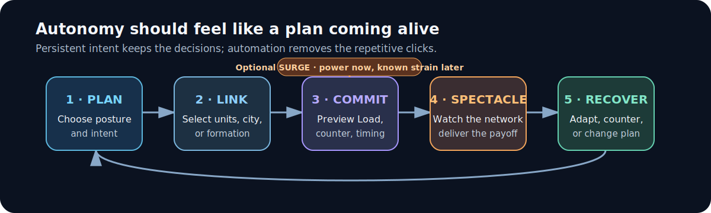
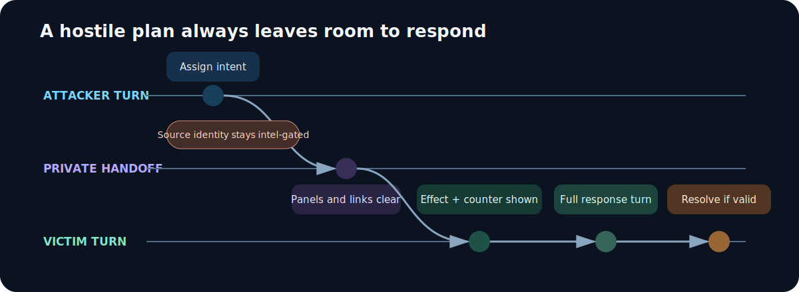
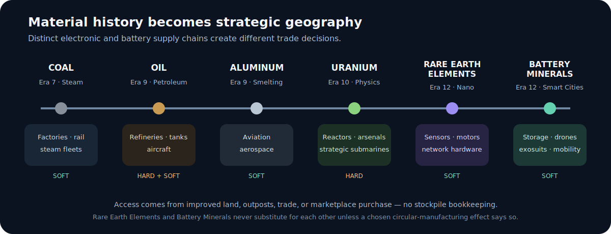
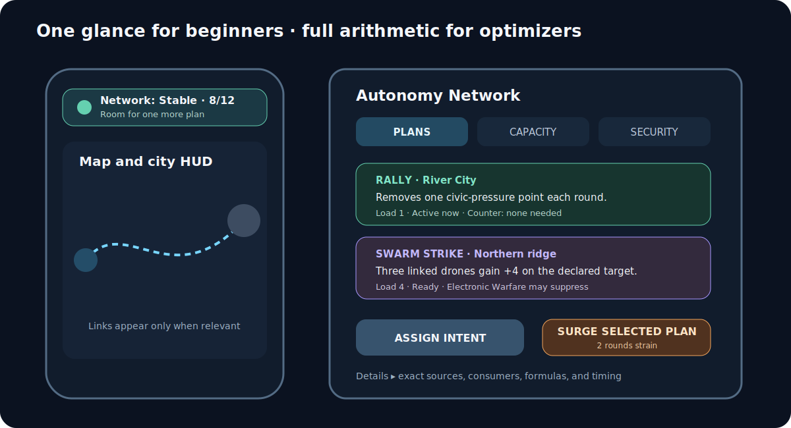
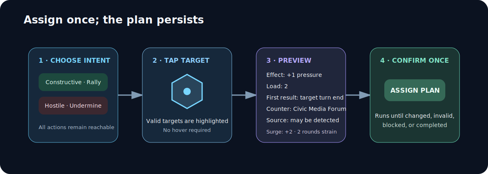
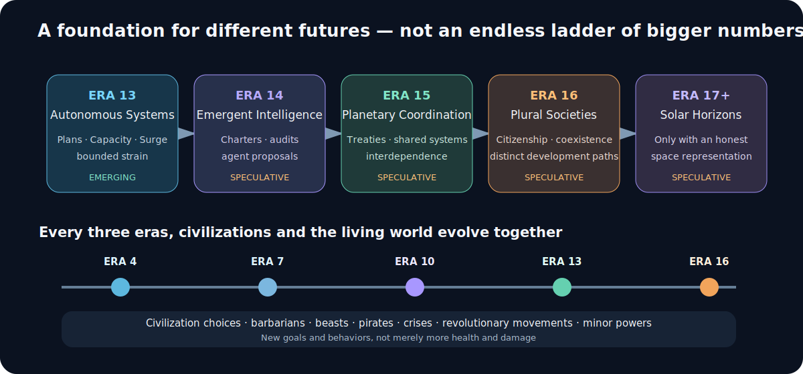

# Era 13+ — Autonomous Systems Design

**Date:** 2026-07-10

**Status:** Approved design for GitHub issue #418

**Related:** #417, #418; Era 12 Information Age design; future World Evolution Across the Ages companion epic

## Purpose

Era 13 must feel like a new strategic phase rather than a catalog of larger numbers. It introduces a shared Autonomy Network foundation, a light empire posture, persistent specialist and formation intents, and voluntary bounded risk. The phase remains recognizably Conquestoria: deterministic, map-based, mobile-first, offline-first, understandable to a seven-year-old, and deep enough for experienced strategy players.

This design also repairs the missing industrial-to-future resource economy before players reach it, removes Era 12 assumptions from pacing and content validation, and defines honest extension points for later eras. Campaigns retain victory conditions but have no era cap.

## Product values

1. **Fun before bookkeeping.** Autonomy enables visible combinations and satisfying payoffs. Load is a budget for plans, not a punishment meter.
2. **Power with bounded responsibility.** Players can voluntarily Surge for a stronger result and known recovery cost. Era 13 never causes a random catastrophe.
3. **Intent instead of micromanagement.** A player assigns a mission, target, or formation once; it persists until changed, invalid, blocked, or completed.
4. **Same rules at every difficulty.** Explorer, Standard, and Veteran change computer decision quality and pressure, never player rules or hidden bonuses.
5. **Every play style receives a new toy.** Specialists have constructive and hostile uses. Peaceful, defensive, covert, maritime, scientific, and aggressive play remain viable.
6. **Historical plausibility with fun fantasy.** History controls sequence, terminology, and material needs. The game compresses supply chains when literal simulation would be tedious.
7. **Honest speculation.** Codex content labels technology as historical, emerging, or speculative. Text never implies a Mars map, culture yield, or resource layer that the game does not implement.
8. **Accessible depth.** Default language explains outcomes in plain terms; exact formulas remain available on demand.
9. **Living-world extensibility.** Every three eras, future civilization identities and independent world systems should be able to evolve through data rather than central switch statements.

## Scope

### Included

- Industrial-to-future resource modernization: Coal, Oil, Aluminum, Uranium, Rare Earth Elements, and Battery Minerals.
- One new Oil Well improvement.
- Hard resource requirements and soft resource advantages.
- Era 12 correction: replace Quantum Computing with Cloud Computing and restore Quantum Computing to Era 13.
- No-era-cap pacing and content validation.
- Versioned save migration for resources and autonomy state.
- Autonomy Network, Control Capacity, Load, strain, posture, persistent plans, and Surge.
- Cyber Unit conversion from passive adjacency drain to persistent intents.
- Propagandist and Drone Controller specialists.
- Combat Drone, Autonomous Frigate, and Exosuit Infantry.
- Thirty Era 13 technologies across all fifteen tracks.
- Twelve buildings, three national projects, and two legendary wonders.
- Player, AI, solo, hot-seat, advisor, UI, visual, SFX, Codex, and accessibility behavior.
- Future-era and World Evolution vision.

### Not included

- Resource stockpiles, depletion, fuel-per-turn logistics, pollution simulation, or a separate Energy or Compute resource.
- Rogue-AI factions, random catastrophic collapse, alternate AI victory, or unavoidable extinction events.
- Full Era 14+ content rosters.
- Mars, lunar, ocean-floor, or orbital map layers.
- The twelve-civilization evolution roster.
- Full barbarian, beast, pirate, crisis, revolutionary-movement, or minor-power evolution rosters.
- Procedurally generated technology filler after the latest authored frontier.

## Core experience

The intended loop is:

**Plan → Link → Commit → Spectacle → Recover**

1. Choose or retain an empire posture.
2. Build enough Control Capacity for the intended network.
3. Assign a constructive, hostile, or formation intent.
4. Link eligible units or cities.
5. Commit once; the plan persists.
6. Receive a visible payoff.
7. Optionally Surge for a stronger resolution and a known recovery period.
8. Adapt to counters, capture, diplomacy, or changing priorities.

Ignoring the system remains viable. Mastering it grants flexibility, coordination, and tempo rather than an unbeatable numeric advantage.

## Autonomy Network

### Derived values

Control Capacity and Autonomy Load are derived from definitions whenever possible. They are not stockpiled yields.

Initial tuning:

- The first Era 13 technology activates the network and grants base Capacity 2.
- After Quantum Networking, a city with one or more recognized Era 12 precursor buildings contributes Capacity 1 total, not one per building, with an empire-wide precursor cap of 4.
- Recognized precursors are Data Center, Signals Hub, Cyber Defense Center, Automated Port, Smart Grid, Space Center, and Semiconductor Fab.
- The first three Network Operations Centers contribute Capacity 2 each; later copies contribute Capacity 1 each.
- AI Safety Institute contributes Capacity 1.
- National AI Assurance Program contributes Capacity 2.
- Drone Fabricator, Civic Media Forum, and Ocean Robotics Yard can each contribute Capacity 1 restricted to formation, civic-defense, or maritime plans respectively, capped at 2 restricted Capacity per category empire-wide.
- Other effects may contribute Capacity only through typed metadata and catalog balance coverage.

The precursor cap and diminishing Network Operations Center contribution let wide empires support more plans without turning city count into linear network dominance. Restricted Capacity gives military, civic, and maritime routes a functional network before they complete the science-heavy Capacity path.

### Network states

- **Stable:** Load is at or below Capacity. All plans operate normally.
- **Strained:** a deliberate Surge is recovering. Existing plans continue and ordinary yields remain intact, but posture benefits are temporarily inactive and the player cannot start or expand a plan. Canceling, shrinking, repairing links, and retargeting at the same or lower Load remain allowed.

Era 13 has no Saturated state and never pauses an ordinary valid plan. Higher-risk states belong to later eras. Base movement, combat strength, city yields, and production never disappear because of network state.

### Postures

Postures use typed definitions and may change once every three rounds. A change is pending until the civilization's next round boundary, preventing same-round exploit switching.

| Posture | Benefit | Tradeoff |
|---|---|---|
| Safeguarded | Capacity 1 reserved for constructive or defensive plans; each newly assigned hostile economic or civic plan targeting this civilization requires one additional preparation round | Own hostile intents cost +1 Load |
| Integrated | No modifier; balanced default | No specialization |
| Accelerated | Surge allowance increases by 2 Load and the Surged resolution receives its defined enhanced magnitude | Recovery lasts three rounds instead of two |

No posture modifies ordinary yields or base unit statistics.

### Surge

- A normal assignment cannot exceed Capacity.
- Surge is an explicit confirmation action on one plan.
- Safeguarded and Integrated have temporary Surge allowance 1; Accelerated has allowance 3.
- Each plan definition declares surgeLoad from 1 to 3. A Surge may temporarily exceed Capacity by no more than the posture allowance for its enhanced resolution; the underlying ordinary plan must still fit normal Capacity.
- The next resolution uses the intent definition's enhanced magnitude while retaining all target caps.
- Integrated and Safeguarded recovery lasts two rounds; Accelerated recovery lasts three.
- Another Surge cannot begin during recovery or cooldown.
- A four-round cooldown starts after recovery.
- Recovery-reduction effects never stack; the greatest valid reduction applies, with a total reduction cap of one round.
- Surge never bypasses diplomacy, visibility, target validity, counters, non-stacking, or the 15 percent city-yield disruption ceiling.

Examples of enhanced magnitude:

- Harden may hold two mitigation charges until the next owner-round refresh rather than its normal cap of one; excess charges then expire.
- Exploit rises from 10 percent to the 15 percent city-yield ceiling at its scheduled resolution.
- Rally removes two civic-pressure points rather than one.
- Undermine adds two pressure points rather than one, still capped at three.
- Guardian Screen or Swarm Strike grants +6 rather than +4 for the next eligible combat.

## Network plans and specialist contract

Every plan records stable IDs, never live objects:

- owner civilization;
- intent definition ID;
- source unit ID;
- target union;
- linked unit or city IDs;
- status: preparing, active, paused, recovering, completed, or canceled;
- creation round;
- next resolution round;
- viewer-scoped detection records.

### Shared specialist rules

- The issue's “active ability per turn” wording is superseded by intent assignment: players choose once, while a valid plan resolves at most once per defined round boundary.
- Strength 0.
- Land domain and normal hex occupancy.
- No attack profile.
- Capturable when an enemy enters the hex, using the canonical civilian capture path.
- Capture clears the old plan and starts one recovery round for the new owner.
- One persistent intent at a time.
- Same-type effects do not stack on the same city or formation; the strongest valid effect wins.
- Friendly and hostile uses exist for every specialist.
- Offensive intent requires war or an explicit future diplomatic permission.
- Range, target, effect, duration, counter, Load, AI tags, presentation, and SFX live in definitions.
- Invalid targets pause or cancel through one canonical cleanup system.

### Cyber Unit

Era 12 retains the unit as a preview of the future. Its passive drain becomes an explicit persistent Exploit intent.

| Intent | Target | Range | Load | Effect |
|---|---|---:|---:|---|
| Harden | Friendly city | 1 | 1 | Renews one 50 percent mitigation charge every two owner rounds |
| Exploit | At-war enemy city | 1 | 2 | Transfers floor(10 percent of base city gold) per resolution; Surge uses 15 percent |

Cyber Defense Center delays the first otherwise unmitigated Exploit resolution and halves every Exploit resolution against that city. Harden consumes one charge to halve the remaining magnitude; unused regular charges cap at one, while AI Safety Institute refreshes one charge every owner round instead of every two. If the unmitigated value is positive, combined defenses leave a minimum transfer of 1, so investment substantially helps without making the specialist permanently useless. Deterministic mitigation replaces the current 65/75 percent block rolls.

### Propagandist

| Intent | Target | Range | Load | Effect |
|---|---|---:|---:|---|
| Rally | Friendly city | 1 | 1 | Removes one temporary network civic-pressure point per resolution |
| Undermine | At-war enemy city | 1 | 2 | Adds one temporary civic-pressure point, capped at three |

Each civic-pressure point reduces the city's contribution to civilization happiness by one. Pressure decays by one per round without a valid hostile plan. Pressure alone cannot satisfy a breakaway or revolutionary-resolution predicate; an independent grievance condition must also be true. Civic Media Forum causes Undermine to resolve only every other target round and reveals the intent category immediately.

### Drone Controller

The issue draft's “AI Drone Controller” becomes the shorter player-facing “Drone Controller”; its definition and Codex text still make the autonomous coordination role explicit.

| Intent | Linked units | Range | Load | Effect |
|---|---:|---:|---:|---|
| Guardian Screen | 1–3 Combat Drones | 2 | 1 + linked drone count | Linked drones gain +4 strength while defending |
| Swarm Strike | 1–3 Combat Drones | 2 | 1 + linked drone count | Linked drones gain +4 strength while attacking the declared target or target zone |

Attack and defense bonuses never apply simultaneously. A linked unit leaving range loses the bonus until the link is restored. Electronic Warfare Array suppresses coordination bonuses against targets within two hexes of its city; it never disables the drones' base stats.

### Constructive infrastructure plans

Network Operations Centers and selected precursor buildings create non-specialist plans so builders, researchers, traders, and explorers participate in the era's central mechanic.

| Plan | Anchor and links | Load | Stable effect | Surged resolution |
|---|---|---:|---|---|
| Fabrication Sprint | Network Operations Center or Smart Grid; its city | 2 | +10 percent base production, capped at +4 | +15 percent for one resolution, capped at +6 |
| Research Mesh | Network Operations Center or Data Center; up to two owned cities with a science building | 3 | +5 percent base science in each linked city, capped at +3 per city | +8 percent for one resolution, capped at +5 per city |
| Logistics Routing | Network Operations Center or Automated Port; one origin city and its first two active routes | 2 | +1 gold per linked route | +2 gold per linked route for one resolution |
| Survey Grid | Network Operations Center or Space Center; one or two Scouts, Expeditions, or Combat Drones | 1 + linked unit count | +1 vision for linked units | +2 vision for one resolution |

Infrastructure plans use the same preview, Capacity, counter, cleanup, viewer, event, SFX, and AI contracts as specialist plans. They never grant movement, cannot stack with another copy of the same plan on the same target, and immediately recalculate the rendered city yield breakdown.

### Hostile timing

- Constructive intents activate immediately.
- Persistent hostile economic and civic intents enter preparing state.
- The target receives an effect warning at the beginning of its next turn.
- The plan resolves at the end of that target turn if still valid.
- The victim always learns the effect and counter.
- Source owner and coordinates appear only when detection rules justify them.
- Drone combat coordination resolves through ordinary combat timing and requires a valid visible link.

## Unit roster

Initial values are balance anchors and must pass the reference-economy and combat-role simulations before implementation is considered complete.

| Unit | Strength | Move | Range | Cost band | Upgrade/role |
|---|---:|---:|---:|---|---|
| Combat Drone | 42 | 6 | 2 | support | Attack Helicopter successor; cheap air skirmisher, below Jet Fighter without coordination |
| Autonomous Frigate | 60 | 5 | 3 | marquee | Destroyer successor; coastal city required; mobile naval network escort |
| Exosuit Infantry | 58 | 3 | 1 | core | Infantry successor; durable objective holder; remains below Tank strength |
| Propagandist | 0 | 3 | — | specialist | Civic support and disruption specialist |
| Drone Controller | 0 | 3 | — | specialist | Formation specialist |

Combat Drone coordination at +4 reaches 46, below the Jet Fighter's base 50. A Surged +6 reaches 48. Private Spaceflight may raise a newly trained Combat Drone from move 6 to 7, not 8. The Autonomous Frigate's base move 5 may reach 7 only through the two already permitted naval bonuses. Exosuit Infantry remains below the Tank's base 62. No Era 13 effect adds global movement. Cost-band calibration makes a Combat Drone materially cheaper than a Jet Fighter, but its controller, Capacity, and coordination opportunity costs prevent disposable massing; reference simulations must reject any drone-only army that outperforms a mixed force at equal total production.

## Late-game resource modernization

### Resource catalog

| Resource | Icon | Base market price | Reveal | Eligible terrain | Improvement | Tile effect | Main uses |
|---|---|---:|---|---|---|---|---|
| Coal | ◼️ | 7 | Steam Power, Era 7 | Hills | Mine | +1 production | Factory, rail industry, Steamship, Ironclad |
| Oil | 🛢️ | 12 | Petroleum Industry, Era 9 | Plains, desert | Oil Well | +1 production | Oil Refinery, tanks, aircraft, motorized warfare |
| Aluminum | 🔩 | 10 | Aluminium Smelting, Era 9 | Hills, desert | Mine | none | Aircraft, aerospace, advanced fabrication |
| Uranium | ☢️ | 16 | Nuclear Physics, Era 10 | Hills, tundra, desert | Mine | +1 science | Nuclear plants, arsenals, Manhattan Project, Missile Submarine |
| Rare Earth Elements | 🧲 | 14 | Nanomaterials, Era 12 | Hills, desert | Mine | +1 science | Sensors, motors, drones, naval autonomy, network hardware |
| Battery Minerals | 🔋 | 13 | Smart Cities, Era 12 | Hills, desert, plains | Mine | +1 production | Energy storage, drones, exosuits, autonomous mobility |

All six are strategic resources. ResourceEffect expands to support science. Base market prices are initial scarcity anchors, not guaranteed transaction prices; the existing supply, demand, access, and relationship model still produces the live price.

### Access model

No stockpile is added. Access comes from the existing canonical sources:

- owned improved tile;
- valid Resource Outpost;
- trade;
- temporary marketplace purchase;
- a definition-driven substitution effect such as Circular Manufacturing Network.

Rare Earth Elements and Battery Minerals are separate because “critical minerals” is a policy umbrella that includes both and would overlap any later resource split. The Codex explains that rare earths are a family of seventeen elements used in magnets and electronics, while Battery Minerals abstracts lithium, nickel, cobalt, graphite, and related storage inputs.

This is the intended gameplay granularity, not a closed taxonomy. Splitting the seventeen rare-earth elements individually would add map clutter and memorization without creating seventeen distinct decisions. Resource definitions instead carry stable ID, materialFamily, reveal, placement band, access semantics, hard-requirement uses, soft-advantage uses, icon, market parameters, and Codex metadata. `rare-earth-elements` and `battery-minerals` are sibling families, never aliases or string-matched categories. Future semiconductor feedstocks, platinum-group metals, fusion fuels, or a genuinely distinct material may be added as a new definition and use list without changing either saved ID. A future design may subdivide a family only when each child creates different geography, trade, or production counterplay; it must add an explicit versioned deposit/access migration and must never silently repurpose an existing resource ID.

### Hard requirements

Hard requirements are limited to intrinsic inputs:

- Oil Refinery requires Oil.
- Nuclear Power Plant requires Uranium.
- Nuclear Arsenal requires Uranium.
- Manhattan Project requires Uranium.
- Missile Submarine requires Uranium.

Marketplace and trade access satisfy requirements. Queue invalidation uses the existing dropped-production feedback path and states the missing resource.

### Resource advantages

Soft advantages reduce production cost without hiding content:

- Coal: 20 percent discount for Factory, Steamship, and Ironclad.
- Oil: 15 percent discount for Tank, Biplane, Bomber, Carrier, and Attack Helicopter.
- Aluminum: 15 percent discount for Jet Fighter, Stealth Bomber, and Combat Drone.
- Rare Earth Elements: 15 percent discount for Combat Drone, Drone Controller, Autonomous Frigate, Electronic Warfare Array, and Network Operations Center.
- Battery Minerals: 15 percent discount for Combat Drone, Exosuit Infantry, Smart Grid, Drone Fabricator, and Circular Fabricator.

Multiple advantages combine multiplicatively but are capped at 25 percent total discount. Existing listed costs become the with-access target; no-access base costs are recalibrated upward so the modernization pass does not accelerate the old late-game economy.

One generic resource-advantage definition table feeds production cost, rush buying, AI scoring, planning recommendations, quest estimates, unit upgrades, and UI. No item-ID branch belongs in a resolver.

### Placement

- Existing early-resource placement runs unchanged.
- Late resources use a separate deterministic pass over remaining eligible empty tiles.
- Coal, Oil, Aluminum, and Uranium each target max(1, round(eligible empty tiles × 0.04)) deposits.
- Rare Earth Elements and Battery Minerals each target max(1, round(eligible empty tiles × 0.02)) deposits, preserving the former single material bucket's 4 percent aggregate target instead of increasing late-resource clutter.
- Uranium has at least one global deposit per major civilization, distributed across landmasses when eligible terrain permits.
- No late-resource guarantee overwrites an early resource, wonder, city, improvement, or reserved start tile.
- Authored and geographic maps use the same normalization helper when their source data lacks the new deposits.
- Newly placed deposits remain hidden until the viewer owns the reveal technology.
- If placement cannot satisfy a requirement, trade, marketplace access, and project substitution remain valid escape valves.

### Oil Well

Oil Well is a worker-buildable improvement restricted to a revealed Oil tile on plains or desert. It uses the normal task, ownership, cancellation, renderer, input, advisor, SFX, and save paths. It does not create offshore drilling; that remains abstract until a real water-improvement system exists.

## Era boundary correction

Era 12 Quantum Computing is renamed and redefined as Cloud Computing:

- Track: science.
- Prerequisites: Integrated Circuits and ARPANET.
- Unlocks Data Center.
- Retains the 15 percent science-track research-efficiency role with wording grounded in distributed computation.

Era 13 restores Quantum Computing with Nanomaterials and Cloud Computing prerequisites. Nanomaterials reveals Rare Earth Elements; Smart Cities reveals Battery Minerals. Cyber Warfare, Autonomous Shipping, Smart Cities, 3D Printing, Lab-Grown Food, Transhumanism, and Private Spaceflight remain in Era 12 as emerging precursors.

## Era 13 technologies

Every definition includes historical status metadata. Era 13 defaults to emerging unless the individual entry is speculative.

General-Purpose AI, Mars Mission Architecture, Molecular Fabrication, Modular Arcologies, Quantum Networking, and Digital Personhood are speculative. All other Era 13 entries are emerging. Historical remains a supported catalog value for established content in other eras.

| Track | Technology | Prerequisites | Player-visible payoff |
|---|---|---|---|
| Military | Autonomous Weapons Systems | Cyber Warfare; Stealth Technology | Combat Drone, Drone Controller, Drone Fabricator |
| Military | Hypersonic Coordination | Autonomous Weapons Systems; Satellite Surveillance | Network-marked ranged attacks gain +3 strength against their declared target; no range increase and no stacking with Swarm Strike |
| Economy | Cooperative Platforms | Digital Economy; Network Governance | +1 gold per domestic trade route; Logistics Routing costs one less Load, minimum one |
| Economy | Universal Basic Services | Cooperative Platforms; Digital Rights | Cities under a constructive plan gain +1 food; the first ordinary unrest increase in a Stable city is reduced by one |
| Science | General-Purpose AI | Cloud Computing; Network Governance | +2 Control Capacity |
| Science | Quantum Computing | Cloud Computing; Nanomaterials | Data Centers gain +2 science; prerequisite for Quantum Networking |
| Civics | Algorithmic Accountability | Digital Rights; Cyber Intelligence | AI Safety Institute; hostile intent category detected one phase earlier |
| Civics | Digital Democracy | Social Media; Digital Rights | Civic Media Forum; Rally removes one additional pressure while Stable |
| Exploration | Autonomous Mobility | GPS Navigation; Autonomous Shipping | Survey Grid costs one less Load, minimum one |
| Exploration | Mars Mission Architecture | Private Spaceflight; Smart Cities | Mars Robotics Initiative |
| Agriculture | Vertical Agriculture | Precision Agriculture; Smart Cities | Vertical Farm |
| Agriculture | Closed-Loop Food Systems | Lab-Grown Food; Green Architecture | Vertical Farms gain +1 food while their city participates in a constructive plan; prerequisite for Carbon-Negative Infrastructure |
| Medicine | Precision Gene Editing | Genomics; Gene Therapy | Neural Rehabilitation Center; units recovering there heal +5 additional HP per round |
| Medicine | Neural Prosthetics | Transhumanism; Programmable Materials | Exosuit Infantry |
| Maritime | Ocean Robotics | Autonomous Shipping; Deep Ocean Research | Autonomous Frigate and Ocean Robotics Yard |
| Maritime | Seabed Stewardship | Deep Ocean Research; Green Architecture | Coastal cities gain +1 production and +1 science; no seabed resource layer implied |
| Metallurgy | Programmable Materials | Nanomaterials; 3D Printing | Circular Fabricator; prerequisite for Neural Prosthetics |
| Metallurgy | Molecular Fabrication | Programmable Materials; Quantum Computing | Circular Fabricators reduce building production cost by 10 percent in their city |
| Construction | Modular Arcologies | Smart Cities; 3D Printing | Modular Arcology |
| Construction | Carbon-Negative Infrastructure | Green Architecture; Closed-Loop Food Systems | Carbon Capture Grid |
| Communication | Quantum Networking | Quantum Computing; Internet Protocols | Each city with a recognized precursor network building contributes Capacity 1 |
| Communication | Ambient Interfaces | Internet Protocols; Transhumanism | Constructive specialist intents cost one less Load, minimum one; prerequisite for Immersive Worlds |
| Espionage | Adversarial AI | Cyber Intelligence; Cloud Computing | Electronic Warfare Array; a Signals Hub reveals the hostile source at resolution when normal detection range is satisfied |
| Espionage | Synthetic Media Operations | Social Media; Mass Surveillance | Propagandist |
| Philosophy | Machine Ethics | Digital Rights; Transhumanism | A Surge made while Safeguarded shortens recovery by one round, minimum one |
| Philosophy | Digital Personhood | Machine Ethics; Secular Rationalism | Integrated posture grants +1 Capacity usable only by constructive civic plans |
| Arts | Co-Creative Arts | Digital Art; Cloud Computing | Immersive Arts Lab |
| Arts | Immersive Worlds | Video Games; Ambient Interfaces | Immersive Arts Labs gain +1 happiness and improve Rally |
| Spirituality | Digital Legacy | New Secularism; Digital Art | Each Immersive Arts Lab gains +1 science; Memory-focused Codex material |
| Spirituality | Contemplative Technology | Mindfulness Movement; Machine Ethics | Strain recovery shortens by one round, minimum one; hostile civic pressure decays one round sooner |

Exact literal research costs are selected by the pacing model so each definition meets its target turn window against the committed Era 13 reference economies. The spec deliberately pins turn windows rather than stale cost literals.

## Buildings

| Building | Cost band | Yields | Requirements and special |
|---|---|---|---|
| Network Operations Center | infrastructure | +1 gold, +1 science | General-Purpose AI; Capacity follows the diminishing empire rule |
| AI Safety Institute | specialist | +2 science | Algorithmic Accountability; Capacity +1; improves Harden and recovery |
| Drone Fabricator | marquee | +2 production | Autonomous Weapons Systems; trains Combat Drone and Drone Controller; +1 formation-only Capacity under the category cap |
| Electronic Warfare Array | infrastructure | +1 production, +1 science | Adversarial AI; suppresses hostile drone links near city |
| Civic Media Forum | core | +1 gold, +1 science | Digital Democracy; Undermine resolves every other target round; +1 civic-defense Capacity under the category cap |
| Vertical Farm | core | +4 food | Vertical Agriculture |
| Neural Rehabilitation Center | infrastructure | +1 food, +2 science | Precision Gene Editing; specialist recovery and nearby healing |
| Ocean Robotics Yard | marquee | +2 production, +1 gold | Ocean Robotics; coastal; trains Autonomous Frigate; +1 maritime Capacity under the category cap |
| Circular Fabricator | infrastructure | +3 production | Programmable Materials; automatically supplies one missing local Rare Earth Elements or Battery Minerals soft advantage for the active item |
| Modular Arcology | marquee | +2 food, +2 production | Modular Arcologies; requires Hospital and Factory |
| Carbon Capture Grid | infrastructure | +2 food, +2 production | Carbon-Negative Infrastructure; requires Factory and Environmental Agency |
| Immersive Arts Lab | specialist | +3 gold, +1 science | Co-Creative Arts; +1 happiness after Immersive Worlds |

Literal production costs are selected so core buildings take 6–10 established-city turns, specialists 5–8, and marquee buildings 10–16. Special buildings may use two yield types because prerequisite chains provide the balance constraint.

## National projects

All are unique per empire, use the Era 7+ yield ceiling, are available in Era 13–14, fade to 0.5 in Era 15, and expire in Era 16.

| Project | Yield | Special |
|---|---|---|
| National AI Assurance Program | +6 science empire-wide | Capacity +2; post-Surge recovery shortened by one round, minimum one |
| Circular Manufacturing Network | +6 production empire-wide | On completion, choose Rare Earth Elements or Battery Minerals substitution empire-wide; grants only that soft advantage and does not satisfy hard requirements |
| Mars Robotics Initiative | +3 science and +3 gold empire-wide | Constructive exploration plans cost one less Load, minimum one |

National-project validation accepts any configured positive homeEra. It is not capped at 12. AI and all player availability paths use the shared reserved-project set.

Circular Fabricator evaluates only the active local production item and supplies at most one missing soft advantage: the larger discount wins, with resource ID as a stable tie-break. It stores no choice and recalculates when production changes. Circular Manufacturing Network stores one substitutionResource on the owning civilization. Its human completion prompt offers both choices, shows affected queued and available items, and recommends the higher current production value; AI uses the same forecast. The empire choice cannot be changed later. Neither effect creates a map deposit or satisfies a hard requirement.

## Legendary wonders

### Open Intelligence Commons

- Historical status: speculative.
- Reward: +4 science empire-wide.
- Special: the first active constructive specialist intent costs zero Load; additional intents cost normally.
- Quest steps:
  1. Research Algorithmic Accountability **and** Machine Ethics.
  2. Build AI Safety Institutes in two different cities.
  3. Resolve three constructive specialist plans while Stable.
- Counterplay: globally unique and visible through normal rival-wonder intel.

### Lunar Gateway

- Historical status: emerging/speculative project identity; Codex distinguishes present proposals from the completed game wonder.
- Reward: +3 science and +3 gold empire-wide.
- Special: autonomous air units gain +1 vision; no movement bonus.
- Quest steps:
  1. Research Mars Mission Architecture **and** Quantum Networking.
  2. In the host city, own a Space Center **and** Network Operations Center.
  3. Maintain a Stable constructive exploration plan in the host city for three resolutions.

Both wonders use typed quest metadata, global uniqueness, no same-civilization self-competition, definition-driven AI selection, rival progress, host-city presentation, Codex art, reveal spectacle, and family-friendly SFX. Conjunctive quest conditions receive negative tests for each half alone.

## AI and difficulty

Computer civilizations use the same resources, posture, Capacity, Load, plans, counters, timing, Surge, capture, and recovery rules.

AI responsibilities:

- select posture at safe round boundaries from personality, geography, resources, and strategic plans;
- forecast Capacity before queueing plans;
- value missing resources according to current and planned production;
- keep the last source of a hard-required input when an applicable item is queued or forecast, while still trading genuine surplus;
- avoid starting a hard-required item from temporary marketplace access when the predicted completion exceeds access expiry, unless a deterministic renewal plan is affordable;
- choose Rare Earth Elements or Battery Minerals substitutions from the same visible production forecast shown to humans;
- score all content through catalog roles rather than IDs;
- create persistent infrastructure, constructive specialist, hostile, and formation plans;
- protect controllers and capturable specialists;
- preserve drone cohesion;
- avoid known counter coverage;
- react only to observed effects and earned intel;
- cancel obsolete plans and recover after capture or conquest.

Network planning uses bounded deterministic candidate sets. The AI ranks valid plans, evaluates only the challenge profile's top-K choices, caches unchanged Capacity/resource forecasts for the round, and never performs an exhaustive unit-by-unit combination search.

Difficulty:

- **Explorer:** fewer concurrent plans, shorter planning horizon, more seeded suboptimal choices, conservative Surge use, and slower counter-building.
- **Standard:** balanced portfolio and calculated Surge use.
- **Veteran:** better combinations, target selection, acquisition, counter timing, and recovery.

Effect magnitude, resource placement, Capacity, Load, prices, costs, and risk rules are identical across difficulty modes. Specialist pressure participates in the existing per-human threat budget, preventing coordinated dogpiles from multiple independent systems.

Explorer still demonstrates the feature: after obtaining Capacity it should maintain at least one useful constructive plan when a valid candidate exists, and after observing a hostile effect it should pursue one valid counter within its configured planReconsiderRounds window. Lower difficulty means less efficient use, not apparent inability to use Era 13.

## UI and UX

### Primary surfaces

- HUD control: Network: Stable · 8/12, posture icon, and remaining-plan hint.
- Network panel:
  - Plans: active intents, links, status, and next effect.
  - Capacity: sources and consumers.
  - Security: detected threats, protection, and counters.
- Selected specialist action: Assign Intent.
- Drone Controller flow: choose intent, tap up to three eligible drones, choose target or zone, preview, confirm.
- Network Operations Center and eligible precursor flow: choose an infrastructure plan, select the city, route, or exploration links, preview, confirm.

### Intent assignment

The preview states:

- outcome;
- Load;
- target and range;
- first resolution timing;
- duration or persistence;
- counter;
- visibility and whether the source may be detected;
- Surge payoff and recovery, when available.

City panels include active infrastructure-plan adjustments in the visible yield breakdown. Unit panels identify their controller or Survey Grid link. Hostile warnings include a direct action to inspect the affected city and, when buildable, focus the relevant counter in production without queueing it automatically. Resource-dependent production rows show hard requirements separately from optional Rare Earth Elements and Battery Minerals discounts. Temporary marketplace access shows its expiry beside the build ETA and warns when access is forecast to lapse first; expiry immediately recalculates visible cost or queue validity.

Recommendation may reorder actions but never hide the full catalog.

### Progressive disclosure

Default phrases use plain language:

- Room for two more plans.
- This city reduces hostile network effects.
- Surging causes two rounds of strain.
- Build a Civic Media Forum to reduce this effect.

An expandable detail view exposes exact values and formulas.

Notifications aggregate repeated plan resolutions into one per-civilization round summary. Capture, first hostile warning, counter completion, Surge, and plan cancellation remain immediate because they require a decision. The notification log retains individual records without replaying every SFX.

### Accessibility

- Mobile-sized touch targets.
- Keyboard-accessible DOM controls.
- Icons always paired with labels.
- Color never the only signal.
- Reduced motion replaces animation with static emphasis.
- Muted audio retains visible timing.
- No hover-only information.
- On the first Era 13 entry, Integrated is selected automatically and the tutorial asks for one recommended constructive plan; it does not open with a posture decision.
- Posture choice is introduced after the first successful plan resolution.
- Surge is introduced only after the player has seen one Stable resolution.
- The tutorial is skippable and replayable, and the full panel remains available throughout.
- Advisors recommend one action with a reason and a direct focus target.

### Play-style guidance

Filters—Build, Research, Trade, Defend, Influence, Explore, Conquer—change recommendations only. Peaceful players can use every specialist constructively and receive infrastructure plans; aggressive players are not forced into city-management chores. Nuclear infrastructure remains optional, so a peaceful civilization without Uranium retains other late-era energy and production paths.

## Solo and hot seat

- Solo advisors surface at most one network recommendation per round and never assign, retarget, Surge, or choose a national-project material substitution without player confirmation.
- An idle specialist may remain on Hold without blocking end turn; intent assignment is an opportunity, not mandatory cleanup.
- All ownership and presentation derive from currentPlayer.
- Plan details and source intel are viewer-scoped.
- Persistent notifications are stored per civilization.
- Handoff closes panels, clears selections and transient links, and disposes viewer-specific audio.
- Hot-seat order is fixed: attacker ends turn → autosave and opaque handoff veil → next player confirms identity → viewer context resets → that viewer's warnings appear → normal input begins → unresolved hostile plans may resolve only at that player's turn end.
- No hostile plan resolves between handoff and the receiving player's opportunity to respond.
- Notifications, map lines, focus targets, SFX, and material-choice recommendations are derived only after identity confirmation.
- Eliminated players' plans cancel through the canonical elimination path.
- AI processing uses one shared non-human scheduler in both solo and hot seat.
- Autosave, manual save, export/import, and handoff round trips preserve plans and viewer intel.

## Architecture

Focused modules:

- resource definitions and placement bands;
- generic resource advantages;
- autonomy posture definitions;
- shared infrastructure and specialist plan definitions;
- network-plan lifecycle and validation;
- effect resolver;
- viewer-safe presentation;
- AI plan evaluation;
- UI panel and target highlighting;
- visual and SFX catalogs.

System boundaries:

- One plan system creates, validates, pauses, resumes, and cancels.
- One effect resolver owns state mutation and emits typed before/after events.
- AI, UI, advisor, preview, and tests call the same evaluation helpers.
- Capture, destruction, diplomacy, conquest, and elimination call shared cleanup.
- No gameplay mutation lives only in main.ts or a UI callback.
- No Math.random; all tie-breaking and migration placement use seeded deterministic helpers.
- Gameplay state remains serializable plain objects.
- Plan effects use a closed typed effect union such as city-percent-yield, route-flat-yield, vision, civic-pressure, mitigation, or conditional-strength. Definitions contain data, not executable callbacks.
- GameState stores autonomyByCiv, networkCivicPressureByCity, and viewer-scoped detection records. IdCounters gains nextNetworkPlanId. Capacity, Load, valid links, and previews remain derived.

### Plan invalidation and feedback

- Missing or captured source: cancel the old owner's plan immediately; capture starts the new owner's recovery.
- Temporarily broken formation link: pause the affected linked unit bonus and show which link must be restored.
- Destroyed target: complete the plan without another effect.
- Captured city: cancel hostile plans from the new ally or owner; revalidate all others against current diplomacy.
- Peace treaty: cancel hostile plans before another resolution.
- Newly completed counter: apply its deterministic delay or mitigation at the next resolution.
- Malformed reference on load: cancel during normalization and create one owner-visible recovery notice.

No invalid plan silently consumes Load, resolves against a replacement object, or remains as an orphaned reference.

## Save schema and migration

Add a root save schema version and ordered migration pipeline in save-manager. New migration must be deterministic and idempotent.

The versioned save-manager pipeline becomes the single entry for new migrations. main.ts may invoke normalization but must not own separate resource, technology-ID, autonomy, or material-choice mutation logic.

Technology rename migration runs before any loaded technology ID is evaluated:

- in saves from the pre-Era-13 schema, every typed Era 12 quantum-computing reference becomes cloud-computing;
- completed, current, and queued research are remapped and deduplicated without losing researchProgress;
- opponentAI researchTargetTechId and every other typed persisted technology-ID field use the same remapper;
- quest/history/event fields are remapped only where their schema declares a technology ID—arbitrary prose is never searched and replaced;
- the newly authored Era 13 quantum-computing remains unresearched after migration;
- a second load performs no additional rename.

Resource migration:

- place missing late deposits only on eligible unoccupied tiles;
- derive a stable seed from saved game ID plus the ordered map-tile identity; if an old save lacks a game ID, hash the ordered tile IDs, coordinates, terrain, and pre-existing resources instead—never use wall-clock time;
- never overwrite resources, wonders, cities, improvements, or reserved starts;
- repair marketplace prices and history for every new resource;
- preserve viewer discovery rules.
- initialize a missing substitutionResource field to null without making a choice for the player.

Legacy hard-requirement handling:

- completed buildings and existing units are grandfathered and never removed;
- production items already queued when migration begins may finish without the newly introduced input;
- all newly queued copies use the new hard requirement;
- the migration notice explains the grandfathering and where future access can come from;
- loading again does not extend or recreate the grace.

Autonomy migration:

- below Era 13, initialize empty state;
- at Era 13+, default to Integrated;
- sort legacy Cyber Units and eligible target cities by stable ID, convert only the first valid same-type plan per city into Exploit, and place additional duplicates on Hold;
- allocate migrated plans in that stable order from nextNetworkPlanId, incrementing the counter for every created plan so later live assignments cannot collide;
- otherwise set the Cyber Unit to Hold with no plan;
- reject malformed or orphaned plans with an owner-visible explanation;
- preserve viewer-scoped detections.

Loading the migrated save twice yields identical serialized state.

## No-era-cap contract

- Era is an unrestricted positive integer.
- Tech, resource, project, evolution, risk, art, and SFX registries accept later-era entries.
- Every authored era must provide an explicit EraPacingProfile with measured production and bounded/completionist research outputs.
- Catalog validation fails during development when authored technology or content references an era with no pacing profile.
- An imported save beyond the latest authored frontier uses the last profile only for generic ETA display and enters the honest frontier state; it does not fabricate costs or content.
- No function clamps an era to 12.
- Project homeEra accepts any configured positive era.
- UI derives era sections from data.
- The campaign continues at the latest authored frontier.
- The UI honestly says that the research frontier has been reached; it does not generate filler or end the campaign.

## Visual and SFX contract

Map feedback:

- links render only for selection, inspection, resolution, or visible threat review;
- constructive plans use calm outward pulses;
- hostile traces appear only with viewer-authorized visibility;
- Surge produces one synchronized effect;
- strain uses intermittent dropout, not a permanent tint;
- fog never leaks a hidden source.

SFX:

- plan assigned: short two-note confirmation;
- link established: one layered ping per formation;
- constructive resolution: warm rising digital texture;
- hostile preparation: restrained interference without identity leakage;
- mitigation: damped pulse, not an error buzzer;
- Surge: one rate-limited system stinger;
- strain entered/recovered: transition cue only;
- specialist capture: shutdown/reboot motif;
- Oil Well completion: mechanical pump startup;
- advanced-material discovery: geological scan cue, shared by Rare Earth Elements and Battery Minerals with distinct visible labels.

New combat units receive distinct movement, attack, impact, damage, and destruction mappings. Specialists receive movement, intent, capture, and destruction sounds without fake weapon audio.

The audio budget reuses existing generic select, confirm, cancel, building-complete, and counter cues where they fit. The four new system motifs are constructive resolution, hostile interference, Surge, and strain/recovery; assignment, mitigation, capture, and discovery adapt existing families. Additional production audio is limited to Oil Well and distinct unit-family actions that cannot honestly reuse an existing sound. One formation produces one link/resolution cue, not one per drone. A viewer never hears hostile preparation, hidden movement, or source-localized audio that their intel does not reveal.

Every sound has visible feedback. Assets must work offline in PWA and Tauri, follow mute/volume/channel/cooldown/deduplication/disposal rules, and use repository-owned, CC0, or CC-BY sources with reproducible metadata and credits. Interference cues avoid harsh sustained high frequencies and continuous alarms for child comfort and long sessions.

## Historical and speculative presentation

Era 13 definition metadata includes:

- historicalStatus: historical, emerging, or speculative;
- approximateTimeframe;
- concise Codex explanation of real basis;
- explicit gameplay abstraction note when necessary.

Historical status is informational, not a power tier. The tone is hopeful but cautious. It avoids both automatic techno-utopia and inevitable machine catastrophe.

The resource Codex treats Rare Earth Elements and Battery Minerals as supply-chain abstractions, not claims that all deposits or refining processes are interchangeable. Gameplay fantasy may compress mining and processing, but the text distinguishes magnetic/electronic materials from electrochemical storage materials.

## Future-era vision

### Era 14 — Emergent Intelligence

- Systems interpret goals rather than merely execute tasks.
- Charters define optimization boundaries.
- AI proposes plans for human approval.
- Audits, appeals, and intent conflicts appear.
- A voluntary Unstable tier offers stronger benefits and previewed failures.
- Specialists may evolve into auditors, mediators, and agent coordinators.

The danger is misaligned execution, not spontaneous evil.

### Era 15 — Planetary Coordination

- Cross-civilization network treaties.
- Shared planetary projects and rival standards.
- Climate restoration and autonomous ecological management.
- Cascading disruption only across voluntarily linked networks.
- Diplomacy around compatibility, access, isolation, and mutual recovery.

The strategic question is interdependence versus resilience.

### Era 16 — Plural Societies

- Human-centered, symbiotic, augmented, synthetic, and distributed development paths.
- Citizenship and representation choices.
- Civilization evolution becomes central.
- Cities specialize around work, creativity, memory, and governance.
- Risk shifts toward legitimacy, exclusion, and fragmentation, never an unavoidable extinction roll.

There is no single correct technological future.

### Era 17+ — Solar Horizons

Lunar, orbital, or Mars settlement appears only with an honest map layer, region system, or explicit remote-settlement surface. Future designs may explore communication delay, autonomous frontier governance, closed ecosystems, and interplanetary logistics.

## World Evolution Across the Ages companion vision

Issue #418 provides extension hooks but does not own these rosters.

Every three eras—initially Era 4, 7, 10, 13, then later configured thresholds—the game should evolve both major civilizations and the living world.

### Civilization evolution

- Two civilization-specific choices at each milestone.
- One deepens the historical identity; one adapts it to current conditions.
- Effects may be a unit, building, project variant, resource affinity, diplomatic behavior, specialist intent, or systemic rule.
- Choices remain typed and AI-evaluable.
- No compounding generic yield multipliers.
- Hot-seat choices occur privately at handoff.
- Older saves prompt humans or deterministically assign AI choices.

### Independent actors and world systems

- Barbarians progress from local bands into context-appropriate organized threats and opportunities.
- Pirates progress through privateers, industrial corsairs, submarine syndicates, and autonomous flotillas.
- Legendary beasts evolve from direct threats into migration, conservation, exploitation, research, diplomacy, or bioengineered resurgence.
- Crises evolve from local scarcity and disease into industrial, financial, climate, network, and interdependence shocks.
- Revolutionary movements respond to real game conditions and can become ideological, nationalist, labor, democratic, separatist, or network-organized without presenting one inevitable history.
- Minor powers and other actors gain era-appropriate goals, diplomacy, and capabilities.

Evolution changes behaviors and decisions, not merely health and damage. Existing actors transform at safe era boundaries. All independent pressure shares the existing per-human budget.

The umbrella should decompose into separate specs for civilization identity, independent actors, and crises/movements.

## Pacing and balance verification

Targets:

- ordinary buildings: 6–10 established-city turns;
- specialists and support units: 5–8 turns;
- marquee units, projects, and wonders: 10–16 turns;
- Era 14 prerequisite paths require enough Era 13 investment to experience the phase;
- yield disruption never exceeds 15 percent of base city yield;
- infrastructure plans obey their per-city caps and cannot recursively increase the base yield used to calculate their own bonus;
- the same city, route, or linked unit cannot receive duplicate copies of one plan;
- Hypersonic Coordination and Swarm Strike are both coordination modifiers; only the strongest applies to one attack.
- drone coordination remains below existing apex-unit baselines;
- equal-production combat simulations reject a dominant drone-only composition and preserve at least one efficient non-network counter;
- no global movement stacking is added.
- a three-city and an eight-city reference empire are compared so Capacity grows sublinearly rather than directly with city count;
- Rare Earth Elements and Battery Minerals each create a useful trade decision, while access to neither remains playable at a slower production pace;
- hard-gated Uranium content remains optional and at least one non-nuclear production path stays competitive.

Required simulation:

- reference Era 13 bounded and completionist economies;
- research growth ratio and production window checks;
- many-seed late-resource distribution across all generators;
- separate scarcity and trade-value distributions for Rare Earth Elements and Battery Minerals;
- tall-versus-wide Capacity, plan-count, and yield-benefit comparisons;
- builder, research, trade, exploration, covert, and military plan portfolios;
- AI versus AI runs on Explorer, Standard, and Veteran;
- solo and hot-seat deterministic replays;
- hostile-pressure convergence checks;
- save migration twice and round-trip equality.

## Test contract

Resource tests:

- catalog, stable ID, material-family, tech, icon, marketplace, improvement, terrain, yield, Codex, and use-list completeness;
- early placement unchanged;
- late placement deterministic and non-destructive;
- hard requirements and soft advantages through every production-cost caller;
- trade, purchase, outpost, loss, queue drop, upgrade, and AI behavior;
- hot-seat discovery isolation.
- Rare Earth Elements and Battery Minerals never alias each other, each has distinct reveal/use metadata, and combined soft discounts respect the 25 percent cap.
- local Circular Fabricator substitution follows the active item deterministically; the empire substitution choice persists, is AI-selectable, and affects only the chosen soft advantage.

Autonomy tests:

- every target/range/Load/diplomacy/timing/effect/cap/counter rule;
- same-type non-stacking and different-type combination;
- normal assignment cannot overload;
- Surge preview equals result;
- capture, destruction, conquest, peace, elimination, and invalid-target cleanup;
- human and non-human parity;
- no source leakage;
- pending hostile plan gives a response turn.
- infrastructure-plan yield, route, and vision caps; no recursive base-yield calculation; immediate visible breakdown refresh.
- strain never pauses an ordinary plan, removes base output, or enables a second Surge.
- Safeguarded delays rather than nullifies hostile effects; layered Cyber defenses retain the minimum positive Exploit result.

Content tests:

- all 30 technologies registered with honest unlocks;
- every unit trainable, upgradeable, AI-classified, rendered, and cataloged;
- every building/project appears in player and AI candidates;
- national-project reservation, display scope, fade, and expiration;
- wonder eligibility, conjunctive negative cases, global uniqueness, and no self-competition.

UI/audio tests:

- assign, retarget, cancel, Surge, counter, and capture rerender immediately;
- full action catalog remains reachable;
- reduced motion, mute, disposal, and handoff;
- visual and SFX catalog completeness;
- accessible labels and no color-only state.
- staged teaching order, skip/replay, round-summary aggregation, counter deep links, and resource-discount explanations.
- no hidden-source SFX or map-line leakage before hot-seat identity confirmation.

No-era-cap tests:

- synthetic Era 14, 16, and 25 definitions work without a clamp;
- project lifecycle works above Era 12;
- frontier UI remains playable without later authored tech.
- any authored-era definition without an EraPacingProfile fails catalog validation.

## Human playtest lenses

Short guided sessions or scripted usability reviews cover:

- first-time younger player;
- peaceful city builder;
- aggressive tactician;
- covert/diplomatic player;
- expert optimizer;
- solo player;
- two- to four-player hot seat.

Success means each player can create one useful plan, enjoy its payoff, and explain one counter without using implementation vocabulary.

Additional acceptance targets:

- a first-time younger player can complete the guided constructive plan without opening formula details;
- an experienced player can reconstruct Capacity, Load, resource discounts, and Surge outcome from the detail view;
- each play-style lens has at least one competitive plan that does not require a specialist from another style;
- Explorer visibly uses the system, Standard combines at least two plan types, and Veteran improves timing without receiving hidden information or numeric bonuses;
- a hot-seat player cannot infer the previous player's plans from handoff residue, sound, focus, or notification timing.

## Delivery slices

Issue #417's proposed single implementation PR is superseded. The approved design requires independently reviewable slices:

1. Late-game resource catalog, placement, Oil Well, access, marketplace, UI, AI, and honest retrofits.
2. No-era-cap pacing, open-ended project validation, and root save schema.
3. Network definitions, plan lifecycle, viewer-safe data, and Cyber Unit conversion.
4. Postures, Capacity, Load, Surge, counters, and core AI.
5. Era 13 units, buildings, technologies, projects, sprites, and unit SFX.
6. Player Network UI, advisors, target flows, accessibility, and hot-seat behavior.
7. Legendary wonders, spectacle, strategic audio, simulation, and final balance.

Each slice must be a complete vertical path or remain hidden behind a feature flag. No visible button, queue item, plan, or recommendation may lead to an unfinished action.

## Final multidimensional review

The post-brainstorm review found and resolved the following design risks:

| Dimension | Risk found | Resolution |
|---|---|---|
| Balance | Capacity scaled too directly with city count | Precursor cap, diminishing Network Operations Centers, and category-restricted Capacity |
| Balance | Exploit's flat maximum was negligible while full shields could nullify it | 10/15 percent payoff, deterministic layered mitigation, and minimum positive result |
| Fun | The network still centered on avoiding strain | Four constructive infrastructure plans give builders, researchers, traders, and explorers visible payoffs |
| New mechanics | Saturated state required undefined plan shedding | Era 13 now has only Stable and Strained; no ordinary plan pauses |
| Ages 7–43 | Posture, Load, plans, and Surge arrived at once | Integrated default and staged teaching: plan first, posture second, Surge third |
| Play styles | Science and specialists owned too much of the system | Restricted Capacity sources and infrastructure plans create viable military, civic, maritime, trade, research, build, and exploration routes |
| Difficulty | Explorer risked looking unable to use new content | Same rules remain; Explorer must still demonstrate constructive plans and observed counters |
| Computer players | Combinatorial plans and materials could cause slow or omniscient AI | Bounded top-K candidate evaluation, cached forecasts, earned intel only, and explicit resource-sale/expiry rules |
| UI | Effects could be correct but invisible in the panel that matters | City yield breakdowns, unit link labels, counter deep links, resource expiry/discount rows, and immediate rerender contracts |
| UX | Repeated resolutions and per-city material choices would create fatigue | Round-summary aggregation and automatic local Circular Fabricator substitution; only the empire project asks once |
| Architecture | Open callbacks and stored totals would drift | Closed effect union, stable plan IDs, canonical resolver, minimal stored state, and derived Capacity/Load |
| Extensibility | Generic numeric extrapolation could silently misprice future eras | Explicit EraPacingProfile required for every authored era; honest frontier fallback for imported saves |
| Data | Critical Minerals overlapped a future Rare Earth split | Separate Rare Earth Elements and Battery Minerals with distinct reveals, uses, placement rates, icons, Codex text, and tests |
| SFX | One sound per unit/link/event could become noisy and leak intel | Event-family audio budget, formation batching, deduplication, comfortable cues, and viewer-authorized playback only |
| Saved games | Reusing quantum-computing could grant the wrong Era 13 technology | Schema-gated typed-ID migration to cloud-computing before tech evaluation, preserving progress and deduplicating state |
| Saved games | New requirements or duplicate Cyber plans could destroy progress | Grandfathered existing queues/units and stable-ID Cyber migration with one same-type plan per city |
| Solo | Advisors and idle specialists could create mandatory chores | One recommendation per round, no automatic strategic choices, and Hold never blocks end turn |
| Hot seat | Warnings, audio, focus, or links could reveal the prior player | Fixed veil/identity/reset/warning order and no resolution before a full response turn |
| Historical/fantasy | One critical-minerals bucket was inaccurate; future claims could overpromise | Separate supply-chain abstractions, historical-status metadata, Codex caveats, and no implied map layers |
| Future world | Major civilizations could evolve while threats stayed static | World Evolution umbrella covers civilizations, barbarians, beasts, pirates, crises, movements, and minor powers every three eras |

No identified review issue remains intentionally deferred inside the Era 13 design. Full civilization and living-world rosters remain explicitly separate companion specs rather than hidden implementation debt.
