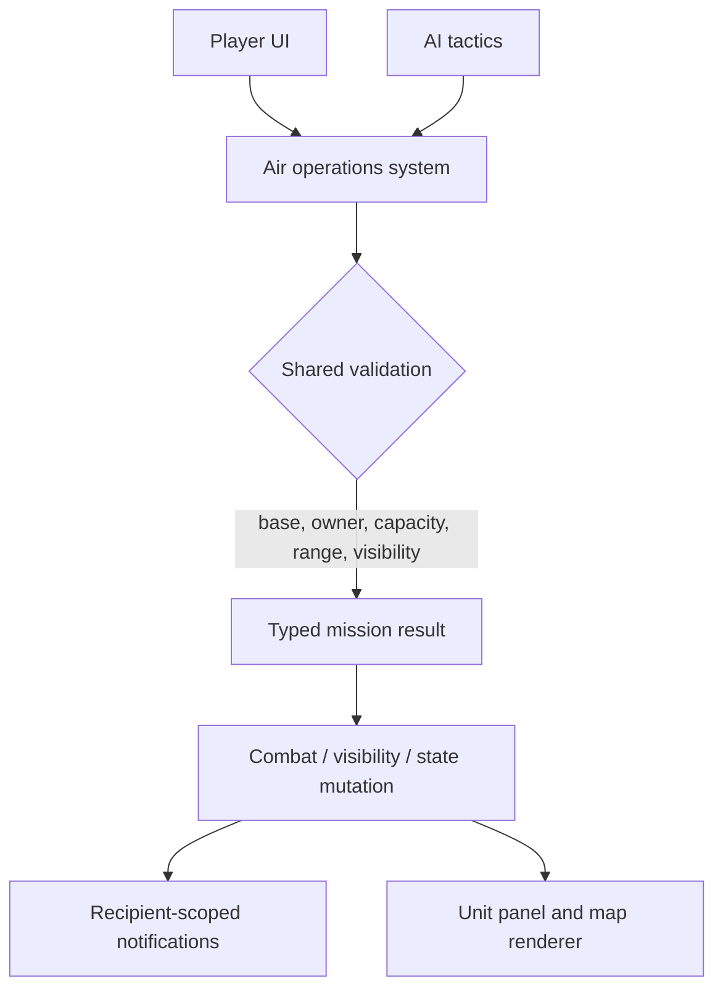
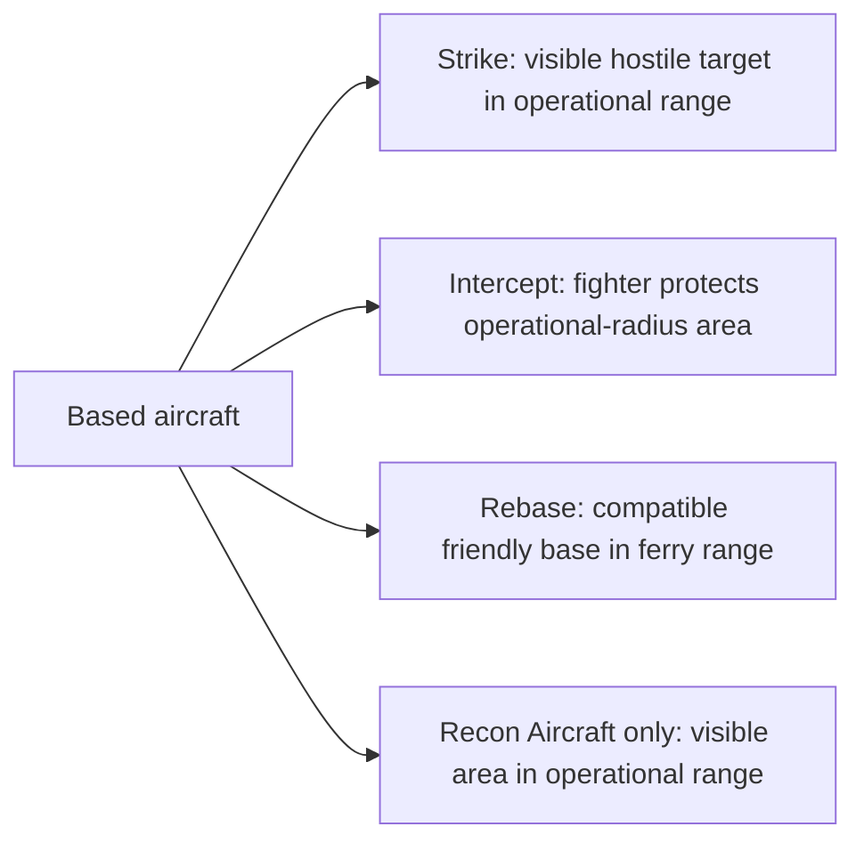

# Air Power Rework Design

**Issue:** #539 — air power rework: basing, operational range, carrier decks, interception

## Goal

Replace open-map aircraft movement with a readable, Axis-&-Allies-inspired base-and-mission model. Combat aircraft operate from capacity-limited facilities, use bounded operational and ferry ranges, and interact with interception before a mission resolves.

## Scope

This design covers biplanes, jet fighters, bombers, stealth bombers, attack helicopters, carriers, a new Recon Aircraft, and the existing Airfield, Helicopter Base, Stealth Airbase, Radar Station, and Air Force Command content.

Observation Balloons and air-trade units retain their current movement model. Airborne cargo and helicopter assault are deliberately deferred to #543.

## Architecture

Aircraft remain serializable `Unit` records. Air-operation metadata on unit definitions declares compatible base kinds, operational range, ferry-range multiplier, and carrier eligibility. A unit's optional air-operation state records its current `AirBaseRef` (`{ kind: 'city', cityId }` or `{ kind: 'carrier', unitId }`) and active mission stance.

`Unit.position` remains synchronized to the hosting city or carrier coordinate for save compatibility and distance calculations, but a unit with an `AirBaseRef` is a **based aircraft**, not a map occupant. One shared `isBasedAirUnit` predicate excludes it from map occupancy, attack-target selection, garrison checks, ordinary unit rendering, unit cycling, and passive vision. Base presentation renders its capacity and aircraft roster instead. Carrier movement synchronizes each based aircraft's mirrored position through the same shared helper.

The air-operations system is the sole owner of validation and mutation. UI and AI only request operations and render typed outcomes; neither reimplements capacity, range, landing checks, or the based-aircraft predicate.

## Facilities and capacity

| Base kind | Eligible aircraft | Capacity | Notes |
| --- | --- | ---: | --- |
| Airfield | Biplane, Jet Fighter, Bomber, Recon Aircraft | 3; 4 with Air Force Command | Fixed-wing standard base |
| Helicopter Base | Attack Helicopter | 2 | Does not host fixed-wing aircraft |
| Stealth Airbase | Stealth Bomber | 2 | Dedicated advanced fixed-wing base |
| Carrier | Biplane and Jet Fighter only | 2 | Moves its based aircraft automatically |

Radar Station provides detection/interception coverage only; it is not a base. Air Force Command retains its existing air-combat bonus and adds one slot to every friendly Airfield.

No city is an implicit airbase. A city must own the relevant facility, have an available slot, and satisfy the unit's base compatibility to host an aircraft.

## Ranges and missions

| Unit | Operational range | Ferry range | Missions |
| --- | ---: | ---: | --- |
| Biplane | 3 | 6 | Strike, Intercept, Rebase |
| Attack Helicopter | 4 | 8 | Strike, Rebase |
| Jet Fighter | 5 | 10 | Strike, Intercept, Rebase |
| Recon Aircraft | 5 | 10 | Recon, Rebase |
| Bomber | 6 | 12 | Strike, Rebase |
| Stealth Bomber | 7 | 14 | Strike, Rebase |

Operational range measures a mission from the aircraft's current base. Ferry range is twice operational range and measures a one-way transfer between compatible friendly bases.

Combat aircraft use Strike, Intercept, and Rebase instead of ordinary map movement. Recon Aircraft use Recon and Rebase. Observation Balloons remain the existing early reconnaissance unit and are not converted to this model.

## Interception and recon

A fighter that chooses Intercept forgoes its strike for the turn and protects locations within its operational range of its current base. One eligible interceptor may engage an incoming hostile mission in that protected area, and an interceptor may engage at most once per turn. The shared selector ranks eligible fighters by projected interceptor damage against the incoming aircraft, then by remaining health, then by lexicographic unit id; the same defender-owned selection is used for human, AI, solo, and hot-seat turns. The combat preview and resolution message name the selected interceptor.

The interception exchange uses the existing #537 fighter-versus-bomber doctrine. A destroyed incoming aircraft aborts its mission. A surviving incoming aircraft completes Strike or Recon with its reduced health.

Recon Aircraft can choose an unexplored or fogged target center within operational range. A Recon mission stores a viewer-scoped `ReconReveal` with the acting civilization id, wrap-aware center, range, and `expiresAtTurn` equal to the current turn. Visibility refresh overlays only that viewer's unexpired reveals after cities and non-based units have contributed vision; at the next turn, the reveal is removed and its tiles return to normal fog/last-seen behavior. Recon creates no permanent satellite-style intel and cannot expose information to another hot-seat player.

## Carrier operations

Carrier-based aircraft automatically travel when their carrier moves and may launch a mission from the carrier's current position. They may rebase between compatible city and carrier bases when a destination slot is open and the ferry-range rule is met. Carrier capacity is fixed at two. Carrier-capable naval strike, patrol, and larger-deck progression are deferred to #582; the existing Bomber remains land-based.

## Base loss and city capture

When a city is captured, each aircraft based there receives a deterministic seeded one-third outcome. Aircraft are processed in lexicographic unit-id order; each roll uses a seed derived from game id, capture turn, city id, and aircraft id:

1. Evacuate to a compatible friendly base within ferry range.
2. Be destroyed on the ground or during evacuation.
3. Be captured and transfer to the victor, based at the captured city.

If evacuation is selected but no legal destination exists, reroll only between destruction and capture. Each outcome generates recipient-scoped notifications. Carrier destruction destroys all aircraft based aboard it, following the existing transport-destruction principle. If a city remains owned but loses a hosting facility, its aircraft immediately evacuate to a compatible friendly base within ferry range or are destroyed when none exists; this outcome is also explicitly notified.

The one-third city-capture odds are identical for every challenge profile and for human and AI civilizations. Difficulty changes the AI's mission, rebase, and intercept choices—not hidden player-facing capture luck.

## Save compatibility

A one-time migration repairs legacy saves that contain combat aircraft on map tiles. It assigns each to the nearest compatible friendly base without applying ferry range. If no compatible base exists, it removes the aircraft and delivers an owner-only load-time explanation. This migration is the only exception to normal landing and ferry rules.

## Player experience

Selecting a based aircraft shows its base, remaining operational and ferry range, health, and legal mission actions. Map highlights distinguish Strike, Rebase, Recon, and Intercept coverage. City/base presentation shows used and total slots and the based aircraft roster rather than duplicate map-unit sprites. A rejected action reports the shared validation reason, and any successful action immediately refreshes the open unit panel and highlights.

| Before | Action | Immediate visible result |
| --- | --- | --- |
| Fighter is based at an Airfield | Select Intercept | Panel reports intercept stance; protected area is highlighted |
| Bomber has a visible target in range | Select Strike then target | Panel and map refresh with its spent action and combat result |
| Aircraft has a legal destination base | Select Rebase then base | Panel reports the new base and updated legal range |
| City has three Airfield aircraft | Try to base a fourth | Action is refused with a visible capacity explanation |

## Audio and accessible feedback

The operation result is always delivered as concise text and, when sound is enabled, through the existing mute/accessibility-safe audio path:

| Outcome | SFX intent | Recipient |
| --- | --- | --- |
| Rebase | soft departure/arrival engine cue | acting owner |
| Intercept | brief scramble cue before air combat | interceptor owner and incoming-aircraft owner |
| Recon complete | calm camera/survey cue | reconning owner |
| Evacuated, destroyed, or captured at base loss | distinct non-alarming outcome cue | affected owner; captor also hears capture |

In hot seat, only the active recipient hears an immediate cue; other recipients receive their private text/audio outcome when their turn becomes active. No SFX is the sole carrier of an outcome.

## AI parity

AI uses the same shared operations. It bases or rebases aircraft toward eligible targets and threatened friendly cities, assigns fighters to Intercept when coverage is valuable, and uses Recon Aircraft to expose unseen target areas. It obeys the same capacity, range, ferry, city-capture, and stable-interceptor-selection rules as the human player. Challenge profiles alter these tactical priorities and willingness to protect bases, never the underlying operation legality or capture-outcome odds.

## Required verification

The implementation plan must include deterministic, focused tests for:

- facility compatibility, capacity, Air Force Command expansion, and carrier movement;
- every mission's positive and negative range/visibility path;
- interception, including one-interceptor-per-turn and survival/abort outcomes;
- stable interceptor selection, preview naming, and human/AI/hot-seat parity;
- based-aircraft exclusion from occupancy, targeting, garrisons, ordinary rendering, cycling, and passive vision;
- temporary recon visibility across repeated same-turn refreshes, wrap, expiry, normal fog reversion, and hot-seat viewer isolation;
- panel/highlight updates after each player action;
- audio/text outcome delivery with mute behavior and hot-seat recipient isolation;
- AI mission selection across challenge profiles and human/AI rule parity;
- city-capture evacuation, destruction, capture, no-legal-base cases, stable seed inputs, and multi-seed balance sampling; and
- legacy save migration with and without compatible bases.

The plan must also run the source-rule checker for changed source files, mirrored targeted tests, and a TypeScript build before publishing implementation work.
