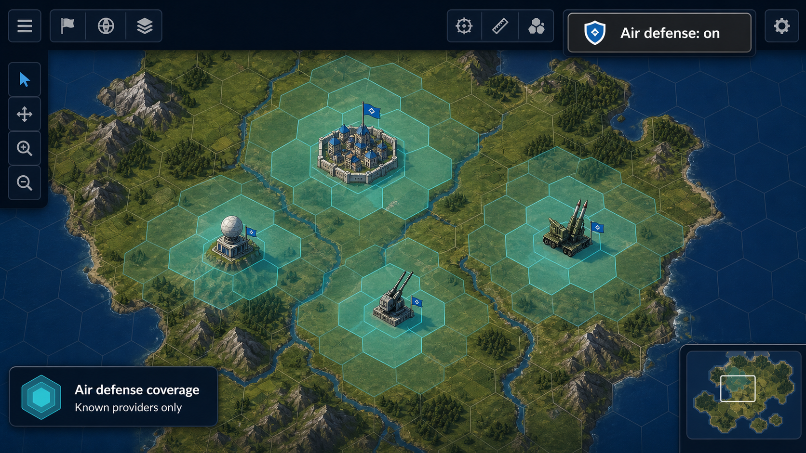
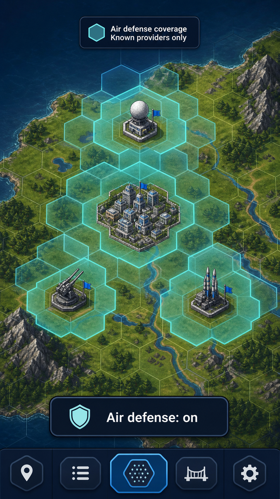

# #695 Radar coverage overlay — design review

**Status:** Design-only draft for review. No gameplay or production UI code changes are included.

## Decision requested

Approve the compact, current-viewer map toggle shown below as the implementation direction.
It keeps air-defense coverage readable without creating a second map-mode surface.

## Proposed player experience

The optional toolbar control appears only after the current player has operational air-defense
coverage. It begins off. Turning it on draws static cyan coverage areas for the current
player's owned providers and providers the current player can presently see.

The control uses icon plus text. On first introduction, help copy spells out
"anti-aircraft (AA) coverage"; the compact control itself says `Air defense` and shows its
pressed state. The visual is informational: it never names, counts, or implies unseen enemy
providers, aircraft, routes, or combat values.

### Desktop concept

### Mobile concept

## Why this direction

- It preserves the current single-toggle interaction, keeping the map clear for players who
  prefer exploration, building, or combat.
- It is understandable for a first-time player: the ring answers "what does this protect?"
  without requiring combat-stat reading.
- It retains exact tactical value for experienced players through the existing provider and
  combat-detail surfaces, rather than turning the overlay into a hidden-information dashboard.
- It meets mobile use: one labelled, 44px-minimum target; no persistent drawer blocks map
  panning or pinch zoom.
- Reduced-motion uses the same still rings—no pulsing, sweep, or animation is required.

## Player truth table

| Situation | Toggle visibility | Rings and legend | Information boundary |
| --- | --- | --- | --- |
| Current player owns no operational provider | Hidden | None | The game does not advertise unavailable coverage. |
| Current player owns an operational provider | Visible, default off | Owned providers when enabled | Owned facts are safe. |
| Current player can see a rival provider | Visible only if the current player also owns coverage | That visible provider may appear when enabled | It reflects current visibility only. |
| Rival provider is fogged or unknown | No change | Never drawn or hinted | No hot-seat or fog leak. |
| Hot-seat handoff | Re-evaluated for the new viewer | New viewer's preference and knowledge only | One player's enabled setting cannot reveal another's intel. |
| Radar Station is pillaged or otherwise non-operational | Re-evaluated immediately | Dependent SAM coverage changes immediately | The map never claims a disabled radar-backed network is active. |

## Misleading UI risks to avoid

- Do not sum overlapping Anti-Air Battery, Mobile AA, SAM Site, or Missile Cruiser values;
  the rules select the strongest provider per stacking group.
- Do not make the ring look like detection, guaranteed interception, or enemy-aircraft intel.
- Do not show a ring for a SAM Site whose Radar Station prerequisite is not operational.
- Do not use cyan, sound, or animation as the only state signal; the pressed label and legend
  communicate state in text.
- Do not leave the old viewer's enabled label visible after a hot-seat handoff.

## Interaction replay checklist

1. Start a solo game before an operational provider exists: no control is shown.
2. Build or repair a Radar-backed provider: the labelled control appears, still off.
3. Enable it: rings and the `Known providers only` legend appear immediately.
4. Pan, zoom, and pinch: the rings remain correctly anchored to their hexes.
5. Enable reduced motion: the same information remains, without an animated sweep.
6. Reveal then re-fog a rival provider: its ring follows current visibility and never persists.
7. Hand the device to a second human: their preference and known providers replace the first
   player's presentation immediately.

## Implementation guardrails after approval

- Radar operational state, SAM coverage, AI valuation, and renderer input must use one typed,
  canonical resolver; neither AI nor renderer may scan the full map per candidate or frame.
- Cache viewer-safe coverage by state revision, invalidate on relevant building/unit/visibility
  changes, and return serializable copies at the boundary.
- Keep Explorer, Standard, and Veteran legality and formulas identical. Difficulty may change
  only existing typed decision pressure, never knowledge.
- Preserve distribution neutrality: no Tauri imports or platform-specific save/UI branches.
- The intended change is presentation and derived state only. If persisted game shape is not
  changed, do not introduce a save migration; if it is, make normalization idempotent and test
  current, schema-0, and previous-schema loads.
- No new sound effect is needed for a visibility-only toggle. If implementation later adds one,
  it must be optional, muted with the mixer, and have a visual/text equivalent.
