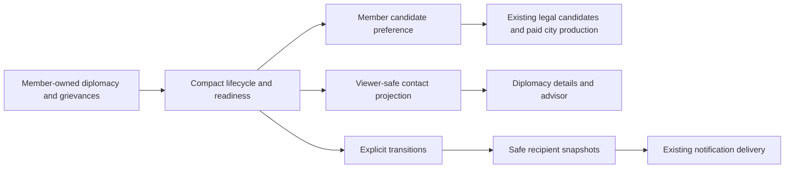

# #496 — City-state leagues and regional compacts

Status: Phase A design; reviewed inline and corrected. Implementation has not started.
Audit date: 2026-09-06. Initial base: `ff3c7eac5cb38d39e285d40f3e87ab2ab5bf4617`; final drift-audited base: `9e3db8f65245034ce19f102dddfbacb71c71991f` (`origin/main`). The two intervening #970 commits fix airborne/transport blockers; no compact dependency changed. The documentation worktree was rebased onto that final base, and the open-PR recheck remained empty.
Issue: [#496](https://github.com/a1flecke/conquestoria/issues/496).
Companion: [implementation plan](../plans/2026-09-06-issue-496-city-state-leagues-implementation.md).

## 1. Product decision

**“Nearby city-states work together while keeping their own cities and friendships.”**

Call these associations **regional compacts** in player-facing text. They are persistent groups of two to four city-states, formed automatically from local contact. An authored charter influences which legal buildings members choose with their own production. Later, a member's war or serious regional grievance can prompt a shared warning and a delayed preference for local defense. Each member pays its own costs and follows its own diplomacy.

This is a hybrid: emergent membership, authored charter vocabulary, deterministic decisions. It creates recognizable neighbors and reasons to scout, trade, complete quests, or pause conquest. It does not add a major civilization, a shared treasury, a commander, or an additional war obligation.

The two implementation slices are complete products: (1) peaceful compacts, investments, disclosure, AI contact safety, saves and UI; (2) defense preparation, warnings, recovery, and its full UI/AI/integration coverage. No controls for later slices appear early.

## 2. Current-main audit and evidence

Current code is authoritative. Historical design statements below are deliberately distinguished from what shipped.

| Area | Current behavior and evidence | Consequence for #496 |
|---|---|---|
| Identity/state | `src/core/types.ts`: `GameState.minorCivs` contains `MinorCivState`; each refers to one `City` and unit IDs. Minors are not `Civilization` records. | Store compact records separately; never add a compact to `civilizations`, owner rosters, or diplomacy actor lists. |
| Economy #490 | `minor-civ-economy-system.ts`: actual food, queue, progress and buildings live on `City`; optional economy contains policy/posture, timing, recovery, levy cooldown, one pending spawn and a recent completion summary. No treasury, resource stockpile or research tree. | Influence candidate scores only. Reuse the minor-safe tech/resource/build candidate pipeline and `processCity`. |
| Hardening | #948 population ceilings are 6/10/14/18 for local pressure-era bands <=2/5/8/later; era upgrades now only record `lastEraUpgrade`. #952 makes production land-only. #954 checks cap drops before queued units complete. | Never restore legacy free era growth/upgrades, naval/air candidates, or over-cap completion. |
| Mobilization #951 | `getMinorCivMobilizationBudget` in `minor-civ-coalition-system.ts` is read-only. `evaluateMinorCivEmergencyLevy` and `performMinorCivEmergencyLevy` in economy own emergency creation. Ordinary unit production is attempted first. Levy costs one population, requires population >2, local/target era >=2, fewer than two living units, legal candidate/spawn, cap room and a ten-turn cooldown; arrives at 65 HP and cannot act that turn. | Compact readiness never supplies `allowsEmergencyLevy`, changes costs/caps, or directly spawns anything. |
| Posture | Economy precedence: recovery; own war/immediate threat; serious own grievance; forming/active coalition; wary grievance or no defenders; settled. Candidate scoring may further prefer defense via the mobilization budget. | Compact preferences sit below all existing emergency/recovery policies, without changing posture or cap evaluation. |
| Grievance | Conquest adds pressure to survivors within wrapped distance 14; base 35, recent-repeat +15 within 12 turns, militaristic +5. Status boundaries 20/45/70; pressure decays 3/2/1 by difficulty after a four-turn block. | Do not duplicate, redistribute, multiply, or rename these records. |
| Coalition | `processMinorCivCoalitionsTurn`: target-specific transient records; >=2 members, population sum >=6 OR >=2 living units; own pressure >=70/talks; countdown 6/4/3; bilateral wars on activation. Candidates are grouped by target, not by a persistent geographic compact. `minorCivRegionalCooldowns` is read, but current reparations do not establish a new league-wide cooling treaty. | A compact is neither a prerequisite nor an automatic member list for coalitions. No #355 redesign is included. |
| Quests/alliance | `quest-chain-system.ts`: normal quest + Friendly can start a three-step chain; `chainStatusByCiv` records durable, nonexclusive alliances; `isMinorCivAllianceActive` also requires peace. Rewards/credit remain issuer–major scoped. | Joining a compact gives no alliance, shared quest credit, transferred bonus, or relationship averaging. |
| Major defensive leagues | In `diplomacy-system.ts`, `canProposeLeague` gates on Writing, no existing league, non-vassal status and positive target relationship when supplied. `proposeLeague`, invite/petition/vote, leave/dissolve and `triggerLeagueDefense` operate on `GameState.defensiveLeagues`. Leave dissolves groups below two; internal war dissolves; leaving during another member's war can incur treachery. There is no equivalent four-member cap in these helpers. | Never reuse `DefensiveLeague`, its `members` array, IDs, treachery, voting, or defense trigger for minors. Reuse only general map distance/immutable collection patterns. |
| #910 | Landed as `5ffec5a1`. Live GameState-level vassalage consent, protection and war consequences now exist. A vassal leaves its major league; minor war actions reject independent vassal war/peace. `processMinorCivTurn` applies `applyVassalageWarConsequences` after coalition processing. | Preserve this final call and existing war pathways. Compact membership confers no overlord/vassal role or foreign-policy permission. |
| Discovery | `hasDiscoveredMinorCiv`: living minor, existing city, viewer tile explored (`visible` OR `fog`). `getMinorCivPresentationForPlayer` masks name and color. The economy presentation currently gives coarse hints to discovered viewers, unlike the old #490 proposal's friendship gate. | Use the shipped discovery rule. Specify exactly which new compact facts are public on contact. |
| Earned intel | Quest presentation requires discovered issuer and viewer-owned assignment. Major AI perception uses visible/remembered observations. Shared vision/recon can make a minor city explored through existing rules; there is no compact-intel record or mission today. | Contact may reveal a compact without revealing other identities. No new espionage mission or stronger queue intel is implied. |
| Minor AI | `planPurposefulMinorCivTurn` senses hostiles within operational radius 6; immediate threats use radius 2; owns its units and plans, with archetype/difficulty strength thresholds. No league actor exists. | Compact logic may combine member-owned declarations/grievances, never share enemy units, queues, research rosters, or target coordinates. |
| Major AI defect at touched seam | `evaluateMinorCivDiplomacy` receives every minor; the late discretionary gift block in `basic-ai.ts` directly debits gold and changes relations. Earlier assigned quest payments already call canonical actions. | Replace this bounded gift seam with discovered, viewer-safe candidates and `performMinorCivGift`; test war, affordability and actor credit. Do not overhaul unrelated AI. |
| Turn ordering | `processMinorCivTurn`: sorted members, reset → grievance → economy → plan/actions → quests → bonuses → garrison → thresholds; coalitions at end. Camp evolution is later in `processTurn`. | Read compact concern from a complete grievance snapshot; keep one world-round scheduler, not one scheduler per human turn. |
| Removal | `conquestMinorCiv` is called by both player-action capture paths and `ai-major-turn.ts`; `peacefullyAbsorbMinorCiv` is called by religious loyalty. Both mark the minor destroyed. No current minor-state restoration/liberation function was found in these paths. | Remove membership in both canonical helpers immediately. Do not invent a liberation feature. A future restored minor rejoins through normal grace/eligibility. |
| Persistence | `CURRENT_SAVE_SCHEMA_VERSION = 27`; #910 owns migration 27. `normalizeLoadedState` normalizes quests, coalitions and economy after migrations. Migrations also have unconditional normalization for current-version malformed data. | Add migration 28 if still next at implementation time, plus current-version shape normalization. No load-time formation, production or event. |
| UI/hot-seat | `diplomacy-panel.ts` filters discovered minors and renders their individual actions. `turn-flow-controller.ts:closeNetworkPanelsForHandoff` already closes/removes diplomacy after #910. `notification-delivery.ts` owns recipient log/toast/pending delivery. | Nest details in the existing panel and use one delivery path with explicit recipient. Do not copy legacy minor listeners' extra manual pending queue. |

Sources inspected: `AGENTS.md`, `CLAUDE.md`, applicable game/UI/mechanics/wiring/spec/incremental rules, the Minor-Civ Economy sections of `.claude/rules/game-balance.md`, `docs/superpowers/plans/README.md`; #490 design and reconciled plan; #948 population plan; quest-chain and regional-grievance designs/plans; hot-seat design; #910 design/plan and current implementation; mirrored economy/presentation/league/vassalage tests and existing long-run fixtures.

The #490 design's final reconciliation explicitly supersedes its old conscription fields. The old regional grievance plan still contains names and mechanisms absent on main. Neither is a specification for new runtime fields. #927's six administration rungs are landed in current history; compacts do not reuse governors, administration capacity, or unrest relief.

GitHub audit: #496 and [#497](https://github.com/a1flecke/conquestoria/issues/497) remain open; no open PRs at the initial audit. Overlaps include [#870](https://github.com/a1flecke/conquestoria/issues/870) logistics/access, [#871](https://github.com/a1flecke/conquestoria/issues/871) border enforcement, [#883](https://github.com/a1flecke/conquestoria/issues/883) naval logistics and [#928](https://github.com/a1flecke/conquestoria/issues/928) governors. Remote branch names include historical #490, #910 and #927 work, but no #496 branch at setup. Branch names are not evidence of unmerged implementation; recheck open PRs and main before each slice. These overlaps are why v1 does not move reinforcements, grant access, or create administrative units.

Baseline: 90 tests passed in four focused files (`minor-civ-economy-system`, `minor-civ-presentation`, `diplomacy-league`, `vassalage-obligations`), and all accompanying hook checks passed. This is baseline evidence, not verification of a new feature.

## 3. Goals, boundaries, and alternatives

Goals: regional identities that survive individual quests; understandable formation; bounded local coordination; meaningful production opportunity cost; recoverable tension; privacy in solo and hot-seat; deterministic saves; no new faction economy.

Rejected alternatives:

1. Static map-authored memberships: easy to teach, but fail generated maps and evolved city-states. Keep authored charter/name vocabulary only.
2. Threat-only leagues with automatic mutual defense: duplicate current coalitions and major leagues, encourage unseen dogpiles, and need access/logistics work outside #496.
3. Shared treasury, donated units, resource pools, voting and sponsorship: too many new ownership and economic paths for the regional-story goal. Revisit only with a separate explicit product decision.

Selected v1 adds no sanctions, shared ally bonuses, compact quests, major membership, sponsorship payment, mediation treaty, expulsion vote, threat action, resource transfer, troop dispatch, movement permission, or graduation roll. Existing gifts, festivals, trade, quests, peace and reparations remain the ways majors interact with each member. Cooperation does not change their prices or legality.

## 4. Authoritative data and modules

Proposed types in `src/core/types.ts` (new, not descriptions of existing code):

```ts
type MinorCivLeagueCharter = 'commerce' | 'learning' | 'security' | 'cooperation';
type MinorCivLeagueReadiness =
  | { kind: 'quiet' }
  | { kind: 'concern'; sinceTurn: number }
  | { kind: 'cooling'; sinceTurn: number };
interface MinorCivLeague {
  id: string;
  nameKey: string; // validated against the fixed 16-key vocabulary
  charter: MinorCivLeagueCharter;
  memberIds: string[]; // sorted; sole source of membership
  formedTurn: number;
  readiness: MinorCivLeagueReadiness;
}
interface MinorCivLeagueState {
  leagues: Record<string, MinorCivLeague>;
  nextId: number;
  nextCheckTurn: number;
  lastProcessedTurn: number;
  eligibleAfterTurnByMinorCiv: Record<string, number>;
}
// GameState: minorCivLeagues?: MinorCivLeagueState
```

No `leagueId` mirror on a minor, new `Civilization`, treasury, research, unit roster, relationship matrix, member strength total, or persistent viewer membership cache. Runtime indices and projections are derived. `eligibleAfterTurnByMinorCiv` is an admission cooldown, not survival history for #497.

Ownership:

- `minor-civ-league-definitions.ts`: constants, name keys and typed charter preference metadata only.
- `minor-civ-league-system.ts`: immutable lifecycle, admission, readiness transitions, cleanup and plain transition results. It does not import UI, economy processing, coalition mutations or major-league helpers.
- `minor-civ-league-presentation.ts`: public contact projection, connected-member detail, safe before/after notice projection. It may call discovery/quest helpers; gameplay never calls presentation to make decisions.
- Economy consumes one read-only compact preference from the league system while scoring legal candidates.
- `minor-civ-system.ts` owns world orchestration; canonical conquest/absorption helpers own immediate removal.
- `minor-civ-league-normalization.ts` under storage owns structural recovery. It does not run the gameplay tick.
- The diplomacy panel and a new small DOM detail builder render projections; `register-diplomacy-presentation.ts` delivers safe notices.



## 5. Formation and membership

Constants live together in `MINOR_CIV_LEAGUE_RULES`; no hidden defaults in UI or AI:

| Constant | Initial value | Rationale / permitted tuning envelope for later work |
|---|---:|---|
| Minimum world turn | 20 | No new coordination in the opening; later tuning 20–40 |
| Admission/rejoin grace | 10 world turns | New, restored and recently separated minors cannot instantly reshuffle; 8–15 |
| Minimum population | 3 | Uses real local capacity; avoids population-2 levy recovery founding a compact; 3–4 |
| Required owned buildings | >=1 | Some local institutional investment; counts existing buildings, no invented tech gate |
| Pairwise radius | 10 hexes | Compact remains a local clique, not a chain across the map; 8–12 |
| Members | 2–4 | One member is not a compact; hard maximum 4 in v1 |
| Active world cap | 8 compacts | Handles evolved minors; hard maximum 8 in v1 |
| Formation/check interval | Explorer 6, Standard 4, Veteran 3 | Pacing only; eligibility is identical |
| Peaceful score preference | +12, once per candidate | Small opportunity-cost shift; later tuning 8–16 |
| Concern notice delay before preparation | Explorer 3, Standard 2, Veteran 1 | Full world-turn warning before extra defense preference; never zero |
| Defense score preference | +25, once per candidate | Paid preparation within the unmodified local cap; later tuning 15–30 |
| Cooling display duration | Explorer 6, Standard 4, Veteran 3 | Reassurance after cause ends; no defense preference during cooling |
| Major AI gift ranking bonus | +5 for a known compact member | Only reorders already eligible discretionary gifts; 0–5 |

Legality, costs, visibility and force caps are invariant across difficulty. Pacing, queue eagerness and the existing difficulty economy multipliers vary. No new per-human setting changes the shared world compact. Use `resolveOpponentChallenge`, not `currentPlayer` or the human's internal-pressure challenge.

**Eligibility:** active minor; defined archetype; city exists and `city.owner === minor.id`; population >=3; >=1 existing building; admission grace passed; world turn >=20; not already a member. No major contact, research, common patron, threat, trade route, or identical archetype is required. Member-to-member formal war is incompatible. Missing inter-minor relationships mean no relationship requirement; they do not justify an invented friendship score.

**Local contact:** city-states can exchange the existence/location of their own city and their own charter intentions inside radius 10. This is an explicit new autonomous diplomatic contact rule. It grants no major viewer discovery, tile vision, enemy observation, or force projection. Water between nearby cities is permitted because the compact exchanges messages, not military access or shipping capacity. Use `mapDistance(state.map, a, b)` so nonwrapping maps do not gain wrap neighbors. Do not rely on the landmass tagger's current nonwrapping flood-fill as a treaty boundary.

**Deterministic schedule:** initialize missing state with empty leagues, `nextId=1`, `lastProcessedTurn=-1`, next check at `max(20, turn+interval)`, and every living minor eligible at `turn+10`. On each world tick register previously unseen living minors with grace `turn+10`; this naturally covers camp evolution on the next round. If `lastProcessedTurn === turn`, skip the scheduled tick. When due, run one check, then set `nextCheckTurn=turn+currentInterval`; do not replay missed checks in a batch. A difficulty change affects the next reschedule, not an already promised deadline.

**Joining before founding:** process existing compacts by `(formedTurn, id)`. Fill vacancies with eligible nonmembers compatible with every member. Rank by number of matching archetypes descending, sum of distances ascending, minor ID ascending. Each joins at most once.

**Founding:** sort all available compatible pairs by same-archetype first, distance ascending, then sorted pair IDs. Pick the first still-unassigned pair; greedily add compatible candidates with the joining ranking up to four; repeat until no pair or the world cap. Use a stable comparator independent of record insertion order. Every pair in a group must be within radius; A–B and B–C proximity cannot admit a distant A–C pair.

**Charter:** majority archetype at founding maps mercantile→commerce, cultural→learning, militaristic→security; a tie maps to cooperation. A strict majority means more than half the founding group. The charter never silently changes after joining/leaving. Names come from the neutral keys `amber, willow, hearth, dawn, cedar, lantern, meadow, silver, oak, reed, copper, laurel, stone, birch, star, olive`, displayed as “Amber Compact”, etc. Pick a seeded preferred name using `createRng(gameId + compactId)` over the fixed vocabulary, then cycle to the first unused live name. No founder name, undiscovered geography, faction color, member count or public sequence number appears in the identity. `id = minor-compact-${nextId++}`; IDs are internal, not DOM labels or test selectors.

**Leaving/removal:** prune destroyed, absent or no-longer-independent owners immediately in conquest/peaceful absorption. A surviving group of two or more retains ID, name, charter and formation date. Fewer than two dissolves; survivors receive a ten-turn rejoin grace. A member-to-member war or invalid pairwise geography dissolves the whole group; no arbitrary leader decides whom to expel. Dropped live members receive the same grace. There is no discretionary voluntary departure or political expulsion action in v1. Falling below admission population does not expel an existing member.

Major alliances, a patron's vassalage, or competing patrons do not dissolve a compact. A destroyed minor's record does not regain membership on liberation: #496 adds no restoration action. If another feature restores it, absent admission tracking starts a fresh grace. A newly created major is never an eligible member.

**Inline design correction — data/extensibility:** a mirrored minor `leagueId` and founder-derived names would create dangling ownership and hidden-identity leaks. The final design uses one membership array, opaque IDs, neutral names and no inferred survival age.

## 6. Shared posture, paid preparation, and recovery

Compact readiness is separate from each city's `MinorCivPosture`. It is not a judgment that every member dislikes a particular major.

In MR2, a **concern source** is a living member's own formal war with a living major, or its own grievance against a living major whose status is `mobilizing` or `coalition-talks`. Require the target's canonical `resolveNeutralPressureEra(state, memberCity.position, targetId) >=2`. These are member-owned/shared diplomatic facts, not hidden enemy armies. A rumor, a nearby peaceful major, a minor's peaceful expansion, a bare relationship score, or another compact's concern is insufficient. No concern propagates between compacts.

Readiness transitions use live sources and `state.turn`:

- Quiet + source → concern with `sinceTurn=turn`; emit one warning transition.
- Concern + continuing source → preserve the original `sinceTurn`; no repeat warning.
- Concern + no source → cooling with `sinceTurn=turn`; stop defense preference immediately.
- Cooling + new source → a new concern with a new warning delay.
- Cooling + no source and elapsed duration >= configured cooling duration → quiet.

Preparation becomes effective only during concern, after the full configured delay, with a live qualifying source and world turn >=20. Do not restart a delay every frame/turn. Save/load preserves the deadline. A future challenge change uses current delay for the remaining concern; it can never authorize preparation on the same turn as its warning because every delay is >=1. The UI shows a coarse “concern reported”/“preparing local defenses” state, not a promise of war or exact production ETA.

**Economy:** get existing legal candidates and baseline scores first. If the member's existing economy posture is anything other than `settled`, apply no compact score change. If settled and preparation is active, add +25 to safe non-scout land unit candidates and `walls`/`barracks` building candidates. This does not bypass unit-cap rejection (negative baseline score stays excluded). If settled and no live concern, add the peaceful charter preference of +12 once: commerce→gold yield >0 or marketplace; learning→science yield >0 or library/temple/monument; security→walls/barracks; cooperation→food or production yield >0. Metadata encodes yield categories and explicit building IDs; never parse descriptions. During a concern warning delay, apply neither preference. Cooling permits the peaceful preference immediately.

Preferences apply only when the existing economy is already selecting a new legal queue head. Never clear a valid active queue, reset its progress, widen eligibility, alter the worker focus, multiply yields, alter cap calculation, or grant free resources. A cap-excluded unit cannot be brought back by a positive score. Production still passes through `processCity`, and delayed spawns use the existing occupied-tile/cap checks. One candidate gets at most one compact bonus. Shared preparation does not feed `wantsDefender`, `allowsEmergencyLevy`, formal war, or the ordinary economy posture.

Allies of a major involved in the concern keep their alliance and bonuses. They may prefer their own defense buildings, but do not fight their patron because of membership. Actual war entry remains exclusively in existing canonical minor-war/coalition/vassalage systems. No member units reinforce another city or receive new tactical targets. Existing radius-6 minor plans stay unchanged.

**Counterplay:** make peace with the involved member; pay existing reparations when eligible to reduce that member's own grievance below serious status; wait for existing pressure decay; keep other causes from remaining active. Paying one member does not erase other members' grievances. Gifts and quests improve their existing relationship/chain effects but do not claim a new tension reduction. Once the last concern ends, extra defense preference ends immediately; cooling is a visible reassurance period, not a war immunity treaty. No discarded queue or automatically disbanded defenders is promised.

**Inline design correction — gameplay/fun/difficulty:** forwarding grievance or raising a peaceful member's posture would silently raise caps and could reopen emergency levies. The final rule modifies only already-legal scores, requires a warning delay, preserves actual posture, and does not amplify another system's aggression penalty.

## 7. Visibility, intel and disclosure

The v1 contract is **ongoing diplomatic contact**, matching discovered-minor presentation on current main. Contact with a living member earns the compact's public name, charter, current broad readiness, and the fact that it may have other members. These are intentionally live public diplomatic facts even when its city is in explored fog. This is not a historical spy report or map-intel snapshot. Do not claim that the viewer has learned every member or can see troops.

| Tier | Earned evidence | Returned data |
|---|---|---|
| Unknown | No discovered living member | `null`/no compact entry, no rumor toast, no names, colors, counts, IDs, coordinates or readiness |
| Contact | At least one discovered member | Neutral name/charter; broad readiness; only discovered living member presentations; boolean `hasUnknownMembers` with text “Other members not yet met” |
| Connected member | Contact AND (an active alliance OR a currently valid viewer-owned trade route to that discovered member) | For that member only: whether compact preference currently applies and its broad class, or “Their own needs take priority”. No queue item, progress, ETA, gold, population, unit count, pressure, enemy or other patron identity |

The trade-route grant requires a record in `marketplace.tradeRoutes`, an extant viewer-owned origin, that member's current minor-owned destination, and `foreignCivId === member.id`. It also requires peace according to `isMinorCivAtWar` and the member's relationship with the viewer >=-25, matching the existing retention boundary in `scrubStaleForeignRoutes`; a route awaiting cleanup grants nothing. There is no `active` field on `TradeRoute`. Do not rerun route creation, require a free caravan, or apply creation's stricter relationship >=0 gate to an established route. A route between two other actors grants nothing. Friendship score alone, incomplete/pending/broken quest chains, old/removed routes, or an undiscovered destination do not grant connected detail. Existing explored visibility earned through alliance/shared vision/espionage is accepted by discovery; #496 adds no additional remote mission. A known compact with unknown members is explicitly representable without a full membership intel table.

Projection helpers build new DTOs. Never spread a league, minor, grievance, enemy target, or city object into a DTO. No total membership count, unknown archetype/color, hidden IDs in `data-*`, tooltip, accessible label, icon or notification target. UI grouping must use opaque transient row indices; a safe internal compact ID may remain in trusted application memory, not visible/serialized markup. No map overlay/lines connecting unknown cities.

Removing the final known member removes the live compact surface unless another current member is discovered. Historical delivered log text remains the already-earned snapshot. No unseen surviving membership is inferred from an old row. For a transition, compute safe before/after projections at the mutation boundary, including the pre-destruction state, and emit only when a recipient's public facts change. A hidden member leaving must not generate an exact count or a named departure.

**Inline design correction — privacy/data:** rendering all member slots with masked names still reveals count, colors and possibly IDs. Render only known members, a single allowed unknown-members sentence, and neutral styling. Keep connected details member-scoped, not league-wide.

## 8. UI, UX, presentation and SFX

The existing City-States section remains the full action catalog. Each known member row gains a short compact line and a native `details`/`summary` disclosure titled “About this compact”. Inside: the plain first sentence, charter purpose, readiness sentence, known members, optional unknown-members sentence, and connected detail for this row only. Show the same identity consistently on member rows; repeated detail is preferable to a new modal or a hidden catalog. All gift/festival/reparations/war/peace controls remain reachable.

Charter copy describes preference, not yield grants: “Members favor trade buildings when their own needs allow.” Defense copy: “A member reports regional tension. Members may prepare their own defenses after a short warning.” Prepared copy: “Members may favor local defenses. Each pays its own costs.” Cooling: “Tensions are easing. Members choose their normal local investments.” Include one permanent explanation in the disclosure: “Each city-state makes its own peace and war decisions.”

Connected detail uses the same effective-preference helper as scoring: “Local priority: trade buildings”, “Local priority: defense”, “Waiting through the warning period”, or “Their own needs take priority”. None means an item is in production. At the ordinary contact tier, do not expose this per-member detail.

MR2 adds plain help beside a discovered member's war action: “This city-state belongs to a regional compact. Other members may prepare local defenses.” Keep existing vassal restrictions and the existing war action; no new authorization or extra confirmation flow. Individual grievance/war labels stay separately truthful. Reparations immediately rerender the open row, cost, eligibility and readiness after the state commit, including when another source means preparation continues.

One viewer-scoped diplomacy advisor tip, triggered only by a nonempty safe compact projection, explains discovery and individual friendships. Use the existing advisor enablement and `viewerScoped: true`; no new global tutorial progress. The diplomacy panel is the primary information surface; no map marker, new icon atlas, minimap tint, new panel route, external art, or sound asset is required.

Mobile/accessibility: wrap text at 320/390px, preserve 44px touch controls, keyboard-operable disclosure, visible focus, semantic headings/list text and readable contrast. No hover-only explanations or color/audio-only facts. Compact text is inserted via `textContent` or text nodes. The detail is a descendant of `#diplomacy-panel`, so existing handoff removal closes it synchronously; do not retain a detached detail DOM or cached prior-viewer DTO.

Events: `minor-civ:league-changed` carries happened turn and already-masked recipient notices, never authoritative state. An explicit before/after mutation diff produces notices once, comparing public identity, known membership and broad readiness (including the delay becoming complete); connected-detail fluctuations do not generate notices. `register-diplomacy-presentation` calls the verified `Notifier.withHappenedTurn` port and `deliver(recipient,...)` once per notice. No second call to `collectEvent`, `showNotification`, or raw audio. Use the ordinary notification behavior; omit a bespoke SFX cue in v1. Normal sound settings/muting remain effective, and no sound plays for an unknown compact or an inactive hot-seat recipient. No formation ceremony or separate compact discovery toast.

The exact event boundary is `runCurrentCompletedRound`'s existing `postprocess(beforeRound,current,eventBus)` callback in `turn-flow-controller.ts`: reconcile compact records and emit the safe diff into its supplied `GameEventBuffer` once, after strategic/supply processing. `completed-round-handoff.ts` adopts the completed state before committing buffered events, and discards failed simulations. Do not also emit compact events from AI capture, religious absorption, or `processMinorCivTurn`; they run inside that round. Direct human mutations in diplomacy/player-action controllers take a before snapshot, install the reconciled result, then emit the same diff once. Record changes that cancel out within one completed round produce one final truthful notice, not a sequence of transient alarms. Existing quest/war events are unchanged.

**Inline design correction — UX/SFX/hot-seat:** a separate compact modal and raw bus audio would bypass the existing handoff closure and recipient delivery. Nest the disclosure and route one safe notice through the current delivery contract.

## 9. AI and mutation order

There is no league AI actor. Member cities contribute only their own identity, position, archetype, owned capacity for admission, and own diplomatic concerns. The compact combines those narrow facts deterministically. It never reads enemy military strength or moves a unit. Member economy scoring consumes its preference automatically; military orders remain the existing minor plan's responsibility.

Major AI uses the same known-member boundary as humans. Replace the late discretionary gift input with a small candidate DTO: `minorCivId`, viewer's relationship, actual gift cost, canonical availability, and `knownCompact` boolean. Filter out undiscovered/destroyed/at-war pairs; no hidden member multiplicity, economy or other patron relationships. Preserve the existing `diplomacyFocus >0.4` and relationship <40 policy. Rank candidates by `-relationship + (knownCompact ? 5 : 0)`, then ID. Execute each affordable gift through `performMinorCivGift` against the latest state and emit returned quest transitions; never debit captured `civ.gold` or mutate raw minor diplomacy. Existing assigned-quest decisions retain their canonical actions. The ranking is not a compact-wide influence currency and grants no immunity from conquest.

World ordering in MR1 runs the league lifecycle before the existing member loop; it reads no grievances yet. MR2 moves all existing eligible-member grievance updates into a sorted prepass, then refreshes compact readiness and runs the current member economy/plan/quest pipeline. This ensures an early member does not see stale peer grievances. After coalition processing and `applyVassalageWarConsequences`, reconcile compact readiness again without running admission or advancing the scheduler a second time. Canonical `setMinorCivWarState` (both success branches), `performMinorCivReparations`, conquest and absorption return reconciled state. The final return of `applyVassalageWarConsequences` also reconciles, so a forced vassal war with a minor does not wait for a world turn. Reconciliation never calls diplomacy or emits, so this dependency cannot recurse. Use the explicit event boundaries in §8 rather than adding a second event owner to every helper. Do not mutate gameplay in a notification listener.

No new attacks occur from compact readiness. Human/AI conquest parity, peaceful religious absorption, coalition war and #910 vassal-driven wars must all reach the same cleanup/readiness rules. Presentation must defensively filter invalid members even before the next world tick if another preexisting owner-changing path supplies malformed state.

## 10. Persistence and normalization

Use the next numbered migration (28 at this audit) and the same exported normalizer for current-version loaded data after base minor normalization. Initialize empty state on legacy saves; preserve existing queues, food, production, units, grievances, coalitions, cooldowns, quests, alliances and vassalage exactly. A normalizer neither forms compacts nor emits events. Initial admission grace gives existing campaigns time to encounter the new layer.

Validation rules are deterministic and idempotent:

1. Accept plain records only. Discard unknown fields. Optional absent whole state receives defaults; malformed whole state receives the same defaults.
2. IDs match `minor-compact-<positive safe integer>` and record keys; the suffix must be strictly below `Number.MAX_SAFE_INTEGER` so a valid next counter exists. Drop records at that exhausted suffix through the same repair/grace path. `nextId` is a safe integer >=1 and strictly above every valid surviving suffix; preserve a larger valid counter, including `Number.MAX_SAFE_INTEGER` as an exhausted counter. No counter reuse after a normal dissolution.
3. Validate known name key/charter, nonnegative integer `formedTurn <= turn`, and readiness enum. Bad identity/charter drops that record. Malformed readiness resets to quiet; future/negative/fractional/nonfinite timestamps are invalid. MR1 initializes quiet; MR2 recognizes the full union.
4. Dedupe/sort members, discard missing/destroyed/not-independent/undefined-archetype references. Keep at most four in sorted order; drop groups below two. Check pairwise radius and no internal war; invalid groups dissolve silently on load with survivors' grace.
5. Resolve cross-record membership conflicts and duplicate live names in `(formedTurn,id)` order: earlier accepted record wins; filter conflicting members from later records, then drop undersized records. Reserve member IDs only after accepting a valid group, so a discarded singleton cannot steal membership from a later valid group. For duplicate names, assign the next unused vocabulary key deterministically. Keep at most eight records in that order. Do not create replacement groups to fill holes. Every live independent minor removed from a record by repair receives admission grace; the second normalization preserves that grace.
6. Track admission times only for living independent minors. Accept integer times in `[0, turn+10]`; invalid/missing times become `turn+10`. Prune expired entries only when the corresponding minor no longer exists/is independent, not merely because its wait passed. This preserves admission determinism across reloads.
7. `lastProcessedTurn` accepts -1 or a nonnegative integer <=turn, otherwise -1. `nextCheckTurn` accepts an integer in `[0, turn+6]`; a past due value is retained (next world tick runs once), otherwise default `max(20,turn+interval)`. The early-turn default can exceed `turn+6`; allow exactly that computed default as well. Preserve valid readiness and scheduling without reevaluating concern on load.
8. Current-version repair and migration must produce the same canonical shape; normalizing twice is identical. Finite safe integer overflow resets invalid counters via valid suffixes, never wraps or creates an invalid ID. Runtime refuses a new formation if incrementing `nextId` would exceed `Number.MAX_SAFE_INTEGER`.

Save/load equivalence covers a due formation check, warning's last waiting turn, readiness activation, cooling expiration, blocked paid spawn, destruction and a half-completed quest. No load-time new unit/event. Migration may repair malformed membership silently, but never asserts an unearned intel event. Both distributions use the same shape.

## 11. Balance, play styles and scenarios

| Scenario/play style | Required outcome |
|---|---|
| Two peaceful mercantile minors; trade/tall player | A commerce compact can form after admission; legal trade-building preferences spend each city's production; no free trade yields or armies. |
| Three militaristic minors near an aggressive major; conquest | Security identity forms within radius. Mature concern warns, then future paid defenses are preferred below existing caps. Current coalitions remain the only additional war-entry mechanism. |
| Mixed region; quest/diplomacy player | Mixed groups allowed, tie→cooperation; each quest/alliance stays independent. A cultural minority keeps its own economy and bonuses. |
| Isolated singleton; isolation | No compact or misleading “forming” badge. No distant forced pairing to meet quotas. |
| Dense 5+ region; wide expansion | Maximum four per group, eight groups globally, one membership per minor; a fifth may remain alone or pair elsewhere. No chained geography or membership snowball. |
| Member destroyed/absorbed | Immediate removal; three→two survives with identity, two→one dissolves. No ghost member, ally transfer or magic replacement. |
| Member allied to a major | Alliance/bonus unaffected by membership or another member's concern; only the existing war rule breaks it. |
| Major attacks one member | Existing defender posture/levy rules apply locally. Compact warns and may bias peaceful peers' later choices; no instant intervention or added levy eligibility. |
| Two majors compete; optimizer | Each can independently earn member alliances. Gift ranking/relationships remain pairwise; no bundled influence or secret strength bonuses. |
| Young Explorer, ages 7–10 | No formation before turn 20, ten-turn admission grace, three-turn warning; ordinary contact gives explanatory text. An era-1 target alone cannot trigger shared preparation. |
| Standard, ages 11–43 | Four-turn formation cadence and two-turn warning. Outcomes are predictable; recovery explanation does not promise that gifts erase grievances. |
| Veteran | Three-turn checks and one-turn warning; better existing production rate remains capped; no extra information or instant war. |
| Hot-seat viewers know different members | Same global politics; different member lists and connected detail. No total count, hidden name/color/id or prior-player DOM survives handoff. |

Conquest is slower only through real future spending, not an extra diplomatic punishment multiplier. Peaceful trade can shape local institutional development but does not grant a windfall. Optimizers can learn the documented scores; casual players need only the summary and warning. A poor recovering member can ignore preferences indefinitely without lying about its queue. Preparation is a preference, never a guaranteed completion time.

## 12. Performance, regressions, and failure modes

Bound live compacts to eight, membership to four, name vocabulary to sixteen, and one readiness object per compact. Build one runtime membership index per orchestration/AI projection operation, not per candidate or DOM field. Formation is at worst O(N²) pair generation plus bounded clique checks, only on cadence; ordinary readiness uses at most 32 member references plus their own diplomatic records. No new map-tile or world-unit scans. The world owns admission records for N living minors; do not reject legal minors merely to cap a save array. Performance tests count checks rather than use fragile millisecond thresholds; stress N=64 on a synthetic map and prove no repeated formation work on nondue or same-turn calls.

Specific regression boundaries: #490/#948/#951/#952/#954 economy; quest/alliance attribution; both conquest paths; religious peaceful absorption; major league/vassal obligations; save schema 27 import; late-game stage transitions; solo fog and hot-seat privacy; event replay and notifier duplication. Do not fix unrelated historical coalition/garrison behavior as part of #496. The existing garrison replacement backstop remains outside compact ownership; no new caller is added.

Testing must include negative conjunctions: mature-but-too-early, old-but-low-population, radius chain but distant pair, discovered-but-not-connected, alliance-but-undiscovered, active source but warning incomplete, warning elapsed but source ended, at-cap plus positive score, recovery plus concern. Compare original input objects after every new pure helper call.

Measure 120-turn seeded peaceful and war scenarios across three difficulties, and compare uninterrupted runs to save/reload traces. Preserve existing long-run cap/population/levy bounds without widening assertions to accommodate failures. Check no compact-induced war, population debit, extra unit, cap increase or production multiplier change by comparing the same state with compact preferences enabled/disabled.

## 13. #497 extension points

Future graduation can read compact identity, charter, formation age and actual member economy. It must call the same canonical removal helper before ownership becomes major, and decide its own relationship/quest/identity conversion. #496 introduces no graduation probability, 50-turn scheduler, survival counter, major template, diplomacy inheritance, territorial grant or hidden power score. A compact is not a graduating actor; graduation remains a property of an individual minor. New persisted evidence for #497 requires its own approved design and migration.

## 14. Inline multidimensional design review — resolved

Rubric applied verbatim:

> perform an INLINE review across these dimensions about balancing gameplay, fun, new mechanics, different player ages (7-43), different play styles, the built in difficulty modes, how computer players will use it, ui, ux, architecture, extensibility, data, sfx, updating saved games, proper testing, regressions solo play, and hot seat plays, and proper implementation.

These are design findings, not claims of code defects already fixed. Corrections are incorporated above before the implementation plan is authored.

| Dimension | Concrete finding | Severity | Required correction | Resolution |
|---|---|---|---|---|
| Balancing gameplay | Raising member posture would also raise caps and could create surplus units. | High | Preferences cannot alter posture/caps/levy gates. | §6 retains paid candidate scoring only; negative cap tests §12. |
| Fun | A threat-only association would feel like a new punishment system. | High | Peaceful formation and useful recognizable identity; no forwarded pressure. | §§1,5,6 define peaceful charters and recovery. |
| New mechanics | Existing coalitions already coordinate war. | High | Assign persistent identity/investment to compacts and keep war ownership separate. | §§2–4,6 prohibit coalition substitution and auto-defense. |
| Ages 7–43 | “Mobilization pact” implies an attack is imminent. | Medium | Plain first sentence; explicit independent war decisions; layered details. | §§1,8 provide final copy and contact/connected tiers. |
| Play styles | A league-wide patron would invalidate multiple individual alliances. | High | Preserve nonexclusive issuer–major contracts. | §§3,6,11 forbid shared influence or bonus transfer. |
| Difficulty modes | Faster preparation could become a zero-warning surprise or reveal more intel. | High | Delays >=1, universal legality/disclosure, era-1 protection. | §§5–7 pin values and their meanings. |
| Computer players | Late AI gifts currently see raw undiscovered minors and bypass actions. | High | Bounded known-candidate projection and canonical gift execution. | §9 specifies the live seam, ranking and state/quest credit. |
| UI | Masked unknown member slots reveal total membership; a stale trade route could retain unearned connected detail. | High | Render only known members plus one existence sentence; validate contact and the live connection independently. | §7 prohibits hidden count/ID/color/tooltip leakage and pins route endpoints, peace and retention gates. |
| UX | “Cooling” could falsely promise immediate peace or discarded defense queues. | Medium | Explicitly end only preference; preserve real diplomacy and valid queues. | §§6,8 define immediate and persistent outcomes. |
| Architecture | Interleaved member grievance ticks could make compact decisions ID-order dependent. | High | Full grievance prepass, one world scheduler, same-turn reconciliation without reticking. | §9 defines order and canonical callers. |
| Extensibility | Reusing a founder ID or admission timer as graduation history would mislead #497. | Medium | Stable independent ID and explicit limited meaning for timing. | §§4,5,13 define boundaries. |
| Data | Mirrored membership and per-target shared grievances overcomplicate saves. | High | One membership array and one untargeted readiness union. | §§4,10 bound persisted state. |
| SFX | Raw event audio would play to the wrong hot-seat viewer or duplicate a toast. | High | Existing recipient delivery only, no custom cue or second queue. | §8 specifies one route and no new asset. |
| Saved games | Forming on load changes a campaign before its next turn; accepting the maximum safe ID leaves no valid next counter. | High | Empty migrated state, grace, structural-only normalization, preserved timers; reserve the maximum safe value for an exhausted counter. | §10 specifies malformed/current-version cases and the exact identity boundary. |
| Testing | Happy-path tests miss conjunctive gates and score legality. | High | Explicit negative pairs and live integration. | §12 and plan matrix require exact assertions. |
| Solo regressions | Solo still contains undiscovered members and can leak in history. | High | Apply identical per-viewer masking and notice snapshots in solo. | §§7,8,12; no solo shortcut. |
| Hot-seat regressions | A detached detail panel could outlive #910's closure. | High | Child DOM only; no cross-viewer cache; actual handoff regression. | §§8,11 specify synchronous removal. |
| Proper implementation | A foundation-only MR could ship an invisible data model with no playable value. | High | MR1 includes peaceful effects and all UI/AI/save wiring; MR2 adds a complete behavior. | §§1,8,9 and implementation plan's merge gates. |

Design review outcome: no unresolved central product/architecture decision. Remaining balance values are specified first-pass choices to validate, not placeholders or claims of playtest success. Terra must stop for a central contradiction; normal code drift or a local bug does not authorize redesign.
